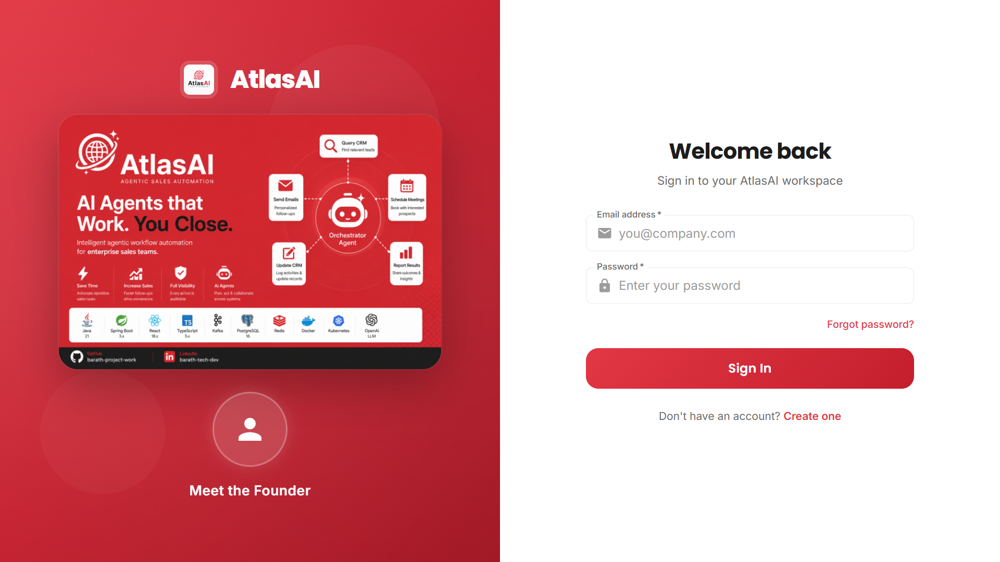
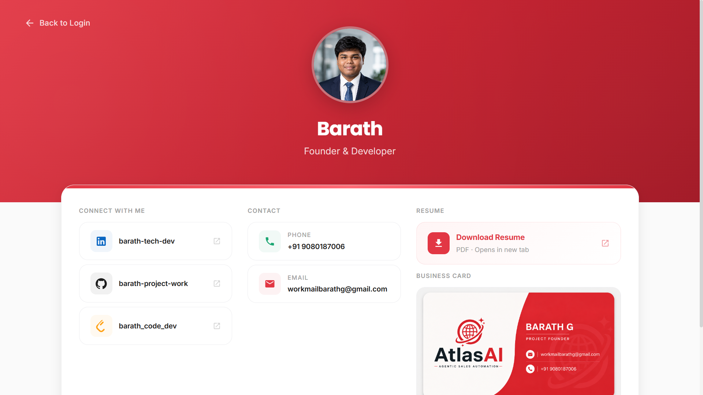
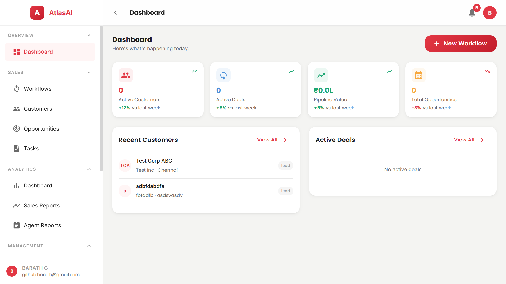
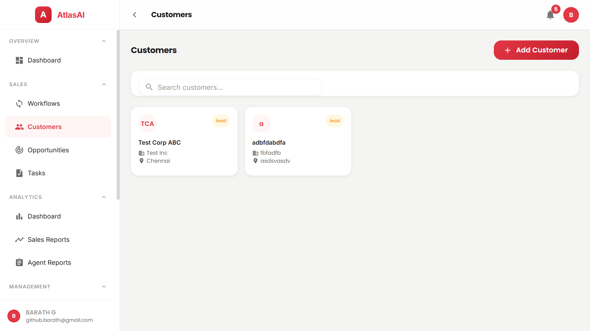
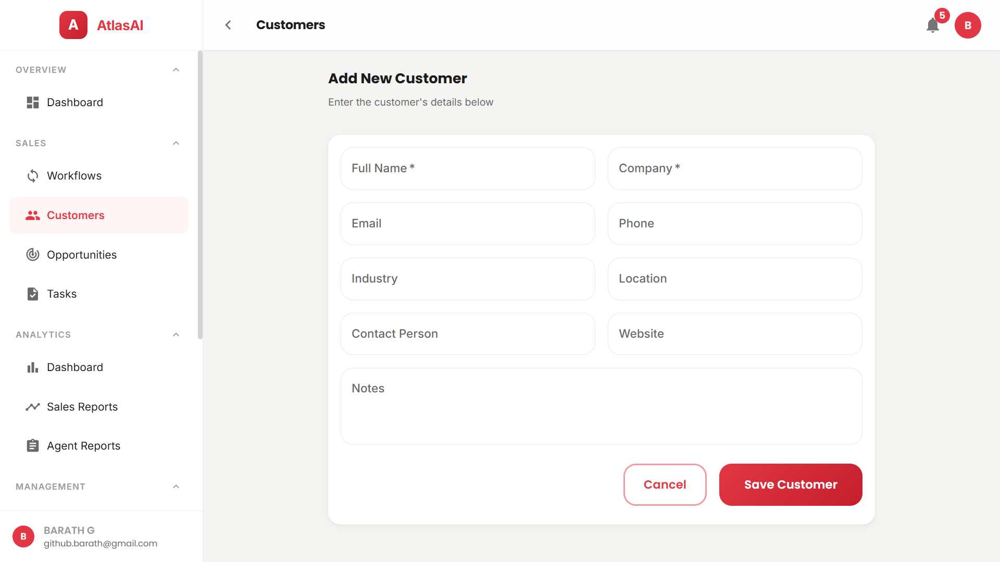

<p align="center">
  <picture>
    <source media="(prefers-color-scheme: dark)" srcset="https://img.shields.io/badge/AtlasAI-Agentic%20Sales%20Automation-8A2BE2?style=for-the-badge&logo=data:image/svg+xml;base64,PHN2ZyB4bWxucz0iaHR0cDovL3d3dy53My5vcmcvMjAwMC9zdmciIHdpZHRoPSI0MCIgaGVpZ2h0PSI0MCIgdmlld0JveD0iMCAwIDQwIDQwIj48Y2lyY2xlIGN4PSIyMCIgY3k9IjIwIiByPSIxOCIgZmlsbD0iIzhBMkJFMiIvPjxjaXJjbGUgY3g9IjIwIiBjeT0iMjAiIHI9IjEyIiBmaWxsPSJ3aGl0ZSIvPjxjaXJjbGUgY3g9IjIwIiBjeT0iMjAiIHI9IjYiIGZpbGw9IiM4QTJCRTIiLz48L3N2Zz4=">
    
  </picture>
</p>

<p align="center">
  <b>Full-Stack Microservices Platform · Java 21 · Spring Boot 3 · React 18 · TypeScript · PostgreSQL · Docker · Railway</b>
</p>

<p align="center">
  
  
  
  
  
  
  
  
  
  
  
</p>

<p align="center">
  <a href="#architecture"><b>Architecture</b></a> ·
  <a href="#live-deployments"><b>Live Demos</b></a> ·
  <a href="#tech-stack"><b>Tech Stack</b></a> ·
  <a href="#documentation"><b>Docs</b></a> ·
  <a href="#getting-started"><b>Quick Start</b></a>
</p>

---

## 🚀 What is AtlasAI?

A **microservices-based platform** that automates enterprise sales workflows through AI-powered agents. Manage customers, track opportunities, and automate follow-ups — all secured by JWT authentication and deployed on Railway.

**What's built & deployed:**
- 🔐 **Auth Service** — JWT login/register, RBAC (3 roles), refresh token revocation
- 📇 **Customer Service** — Full CRUD for customers & opportunities with paginated search
- 🖥 **Frontend** — 40+ page React SPA with real API integration (not mock data)
- 🤖 **AI Agent Service** — Python orchestrator with CRM/Email/Calendar agents (needs OpenAI key)
- ✅ **CI/CD** — GitHub Actions builds all 7 services on every push, Railway auto-deploys

---

## 🏗 Architecture

```
┌──────────────────────────────────────────────────────────┐
│                   Frontend (React SPA)                     │
│                  Nginx Reverse Proxy                       │
├───────────┬──────────────────────────┬───────────────────┤
│  /api/auth│  /api/customers          │  /api/opportunities│
│     │     │         │                │         │         │
│  ┌──▼──┐  │   ┌─────▼──────┐        │  ┌──────▼─────┐   │
│  │Auth │  │   │ Customer   │        │  │  Customer  │   │
│  │:8081│  │   │ :8082      │        │  │  :8082     │   │
│  └──┬──┘  │   └─────┬──────┘        │  └──────┬─────┘   │
│     │     │         │               │         │         │
│  ┌──▼──┐  │   ┌─────▼──────┐        │         │         │
│  │Users│  │   │ Customers  │        │         │         │
│  │ DB  │  │   │ + Opps DB  │        │         │         │
│  └─────┘  │   └────────────┘        │         │         │
└───────────┴──────────────────────────┴───────────────────┘
```

| Service | Stack | Status | What It Does |
|---------|-------|--------|-------------|
| **Auth Service** | Java 21, Spring Boot, JPA, PostgreSQL | 🟢 Deployed | Registration, JWT tokens, RBAC (USER/MANAGER/ADMIN) |
| **Customer Service** | Java 21, Spring Boot, JPA, PostgreSQL | 🟢 Deployed | Customer & opportunity CRUD with paginated search |
| **Frontend** | React 18, TypeScript, MUI 5, Vite | 🟢 Deployed | 40+ page SPA with real API integration |
| **AI Agent Service** | Python 3.11, FastAPI, OpenAI SDK | 🟡 Coded | Orchestrator agent with CRM/Email/Calendar tools |
| **Workflow/Task/Notification/Search** | Java 21 (scaffolded) | ⬜ Future | Remaining microservices |

---

## 🖥️ Screenshots

<p align="center">
  
  
</p>

<p align="center">
  
  
</p>

<p align="center">
  
</p>

---

## 🌐 Live Deployments

| Component | URL | Status |
|-----------|-----|--------|
| **Frontend** | [`cheerful-respect-production-1c45.up.railway.app`](https://cheerful-respect-production-1c45.up.railway.app) | 🟢 Live |
| **Auth Service** | [`agentic-workflow-automator-production.up.railway.app`](https://agentic-workflow-automator-production.up.railway.app) | 🟢 Live |
| **Customer Service** | [`customer-service-production-0ff7.up.railway.app`](https://customer-service-production-0ff7.up.railway.app) | 🟢 Live |

---

## 🛠 Tech Stack

### Backend
| Technology | Purpose |
|------------|---------|
| **Java 21** + **Spring Boot 3.3** | Core framework for all microservices |
| **Spring Security 6 + JJWT 0.12.6** | JWT authentication with HMAC-SHA256 |
| **Spring Data JPA + Hibernate** | ORM with PostgreSQL 16 |
| **Maven** | Build & dependency management |
| **Lombok** | Boilerplate reduction |

### Frontend
| Technology | Purpose |
|------------|---------|
| **React 18 + TypeScript 5** | Single-page application |
| **Vite 5** | Build tool & dev server |
| **MUI 5 (Material UI)** | Component library & design system |
| **Zustand** | Lightweight state management |
| **TanStack Query** | Server state & caching |
| **Axios** | HTTP client with JWT refresh interceptor |
| **React Router 6** | Client-side routing |
| **React Hook Form** | Form management |
| **Recharts** | Analytics charts |

### DevOps
| Technology | Purpose |
|------------|---------|
| **Docker** | Multi-stage container builds |
| **Docker Compose** | Local PostgreSQL + Redis + Kafka |
| **Nginx** | Reverse proxy & API routing |
| **GitHub Actions** | 7-job CI pipeline on every push |
| **Railway** | Production deployment with auto-deploy |

---

## 📚 Documentation

Detailed documentation for every component:

| Document | Covers |
|----------|--------|
| [**Architecture**](docs/Architecture.md) | Full system design, service topology, communication patterns, data flow |
| [**Authentication**](docs/Authentication.md) | JWT flow, SecurityConfig, token structure, RBAC matrix |
| [**API Reference**](docs/API.md) | Complete endpoint list with request/response schemas |
| [**Database**](docs/Database.md) | Schema design, entities, column types, indexing strategy |
| [**Infrastructure**](docs/Infrastructure.md) | Docker, Nginx config, CI/CD pipeline, Docker Compose |
| [**Deployment**](docs/Deployment.md) | Railway setup, env vars, troubleshooting guide |
| [**Debugging & Fixes**](docs/Debugging.md) | JWT 403 fix, `bytea` column diagnosis, Railway learnings |

---

## 🚀 Getting Started

```bash
# 1. Clone
git clone https://github.com/barath-project-work/Agentic-Workflow-Automator.git
cd Agentic-Workflow-Automator

# 2. Start infrastructure
docker-compose -f infra/docker-compose.yml up -d

# 3. Start auth service
cd services/auth-service && ./mvnw spring-boot:run

# 4. Start customer service (new terminal)
cd services/customer-service && ./mvnw spring-boot:run

# 5. Start frontend (new terminal)
cd frontend && npm install && npm run dev
```

### Quick API Test
```bash
# Register
curl -X POST http://localhost:8081/api/auth/register \
  -H "Content-Type: application/json" \
  -d '{"name":"Test","email":"test@test.com","password":"pass123"}'

# Login
TOKEN=$(curl -s -X POST http://localhost:8081/api/auth/login \
  -H "Content-Type: application/json" \
  -d '{"email":"test@test.com","password":"pass123"}' | python -c "import sys,json;print(json.load(sys.stdin)['accessToken'])")

# Create customer
curl -X POST http://localhost:8082/api/customers \
  -H "Authorization: Bearer $TOKEN" -H "Content-Type: application/json" \
  -d '{"name":"Acme Corp","company":"Acme Inc","industry":"Tech"}'

# List customers (paginated)
curl "http://localhost:8082/api/customers?page=0&size=20" -H "Authorization: Bearer $TOKEN"
```

---

## 📁 Project Structure

```
├── services/
│   ├── auth-service/            # 🔐 JWT auth (8081)
│   ├── customer-service/        # 📇 CRM (8082)
│   ├── workflow-service/        # 🔄 Scaffolded (8083)
│   ├── task-service/            # 📋 Scaffolded (8084)
│   ├── notification-service/    # 📧 Scaffolded (8085)
│   ├── search-service/          # 🔎 Scaffolded (8086)
│   └── ai-agent-service/        # 🤖 Python agents (8087)
├── frontend/                    # 🖥 React SPA
├── infra/                       # 🐳 Docker Compose
├── docs/                        # 📚 Documentation
└── .github/workflows/           # ⚙️ CI/CD
```

---

## 🔍 Key Debugging Achievements

During development, several non-trivial issues were systematically diagnosed and resolved:

1. **JWT 403 Silent Failures** — Zero-logging JWT filters made debugging impossible → Added SLF4J logging + filter chain continuation
2. **PostgreSQL `bytea` Column Bug** — Columns created as binary instead of varchar → Added `columnDefinition` + `findAll()` fallback
3. **Railway `DATABASE_URL` Parsing** — URI format mismatch → Created `DataSourceConfig.java` parser
4. **Redis/Kafka on Railway** — Auto-config crashes → Removed from production deps
5. **Nginx Trailing Slash** — Proxy mismatches → Fixed location block patterns

[**Full debugging details →**](docs/Debugging.md)

---

<p align="center">
  <a href="docs/Architecture.md"><b>📐 Architecture</b></a> ·
  <a href="docs/API.md"><b>📡 API Reference</b></a> ·
  <a href="docs/Deployment.md"><b>📦 Deployment</b></a> ·
  <a href="docs/Database.md"><b>💾 Database Schema</b></a>
  <br/><br/>
  Built with ❤️ using Java 21, Spring Boot 3, React 18 & TypeScript
  <br/>
  <i>Automating sales workflows, one agent at a time.</i>
</p>
