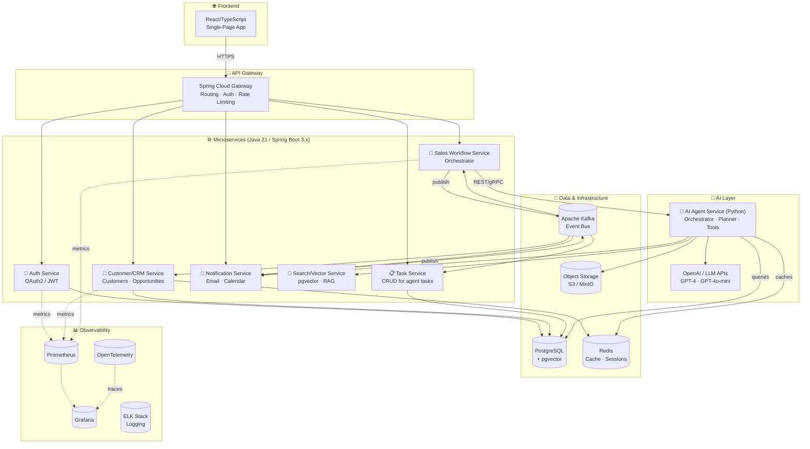
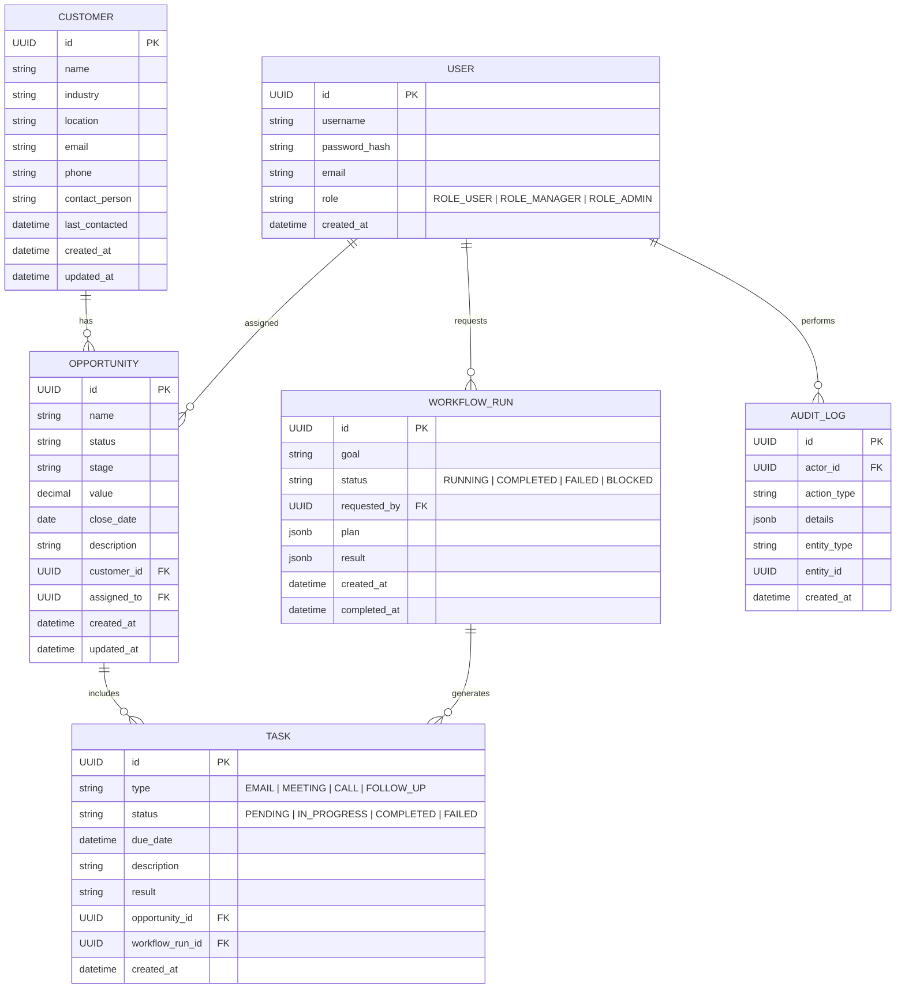
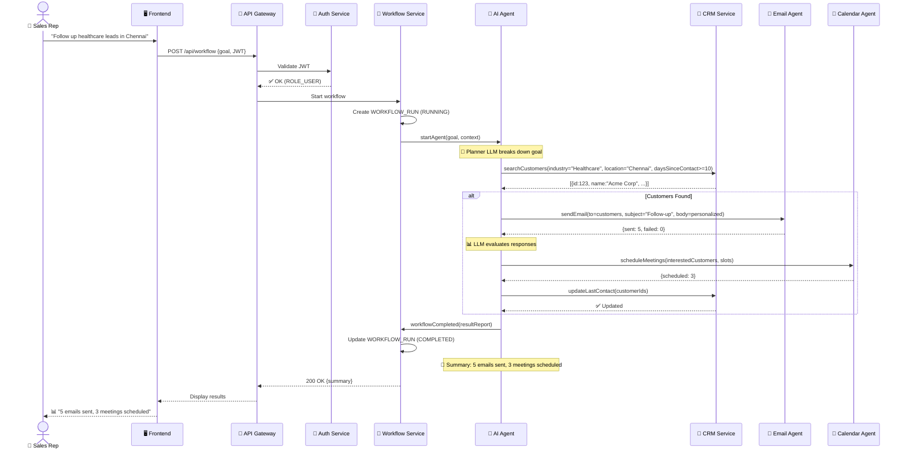
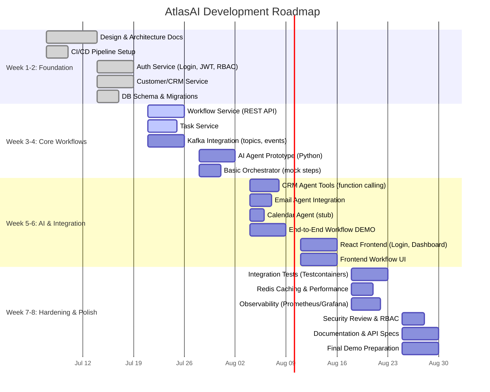

<p align="center">
  <picture>
    <source media="(prefers-color-scheme: dark)" srcset="https://img.shields.io/badge/AtlasAI-%F0%9F%A4%96%20Agentic%20Sales%20Automation-8A2BE2?style=for-the-badge&logo=data:image/svg+xml;base64,PHN2ZyB4bWxucz0iaHR0cDovL3d3dy53My5vcmcvMjAwMC9zdmciIHdpZHRoPSI0MCIgaGVpZ2h0PSI0MCIgdmlld0JveD0iMCAwIDQwIDQwIj48Y2lyY2xlIGN4PSIyMCIgY3k9IjIwIiByPSIxOCIgZmlsbD0iIzhBMkJFMiIvPjxjaXJjbGUgY3g9IjIwIiBjeT0iMjAiIHI9IjEyIiBmaWxsPSJ3aGl0ZSIvPjxjaXJjbGUgY3g9IjIwIiBjeT0iMjAiIHI9IjYiIGZpbGw9IiM4QTJCRTIiLz48L3N2Zz4=">
    
  </picture>
</p>

<p align="center">
  <b>Intelligent Agentic Workflow Automation for Enterprise Sales Teams</b>
</p>

<p align="center">
  
  
  
  
  
  
  
  
  
  
</p>

---

## 📋 Table of Contents

- [Vision & Mission](#-vision--mission)
- [What is AtlasAI?](#-what-is-atlasai)
- [Architecture Overview](#-architecture-overview)
  - [High-Level System Diagram](#high-level-system-diagram)
  - [Database ER Diagram](#database-er-diagram)
  - [Workflow Sequence Diagram](#workflow-sequence-diagram)
- [Tech Stack](#-tech-stack)
  - [Backend](#backend)
  - [Frontend](#frontend)
  - [Data & Storage](#data--storage)
  - [Event Streaming](#event-streaming)
  - [AI & Agent Frameworks](#ai--agent-frameworks)
  - [DevOps & Infrastructure](#devops--infrastructure)
  - [Observability](#observability)
- [Features](#-features)
  - [MVP Core Features](#mvp-core-features)
  - [Stretch Goals](#stretch-goals)
- [Agent Architecture](#-agent-architecture)
- [Project Structure](#-project-structure)
- [Getting Started](#-getting-started)
  - [Prerequisites](#prerequisites)
  - [Local Development Setup](#local-development-setup)
  - [Running the Services](#running-the-services)
- [API Overview](#-api-overview)
- [Development Roadmap (8 Weeks)](#-development-roadmap-8-weeks)
- [Security & Compliance](#-security--compliance)
- [Testing Strategy](#-testing-strategy)
- [Contributing](#-contributing)
- [License](#-license)

---

## 🌟 Vision & Mission

### Vision

Empower sales teams by **automating routine sales workflows** through intelligent AI agents. Sales goals become high-level tasks; the system autonomously handles data lookup, communication, and record updates — no manual follow-ups, no missed leads, no repetitive busywork.

### Mission

Build an enterprise-grade **Agentic Sales Workflow Automation Platform** that mirrors the promise of Salesforce's **Agentforce** — where AI agents *plan, act, and collaborate* across systems — but with the flexibility, transparency, and control that modern sales operations demand.

---

## 🤖 What is AtlasAI?

**AtlasAI** allows sales representatives and managers to issue high-level goals in natural language (e.g., *"Follow up with healthcare leads in Chennai"*) and have the system's AI **orchestrator agent** autonomously:

1. Query CRM data for matching leads
2. Draft and send personalized follow-up emails
3. Schedule meetings with interested prospects
4. Update CRM records
5. Report comprehensive outcomes

This is **not** a static chatbot — it's a **delegation engine**. A user asks *"What needs to be done?"* and AI agents execute multiple steps to deliver the outcome.

### Key Benefits

| Benefit | Impact |
|---------|--------|
| ⚡ **Dramatic Time Savings** | Automates hours of manual follow-up work per rep per day |
| 📈 **Higher Conversion Rates** | Faster lead responses → warmer prospects → more closed deals |
| 🔍 **Transparent AI Oversight** | Every agent action is auditable and traceable |
| 🎯 **Consistent Execution** | No more missed follow-ups or dropped leads |

### Target Users

| Persona | Needs |
|---------|-------|
| **Sales Representative** | Automate follow-ups, lead nurturing, and meeting scheduling |
| **Sales Manager** | Set business rules, define templates, monitor KPIs |
| **Ops / IT Admin** | Configure integrations, manage security, review audit logs |

---

## 🏗 Architecture Overview

AtlasAI uses a **microservices, event-driven architecture** with clear separation of concerns and modern cloud-native infrastructure.

### High-Level System Diagram



### Database ER Diagram



### Workflow Sequence Diagram

A typical sequence for a *"Follow Up Leads"* workflow:



---

## 🛠 Tech Stack

### Backend

| Technology | Purpose | Version |
|------------|---------|---------|
| **Java** | Core language for microservices | 21 (LTS) |
| **Spring Boot** | Application framework | 3.x |
| **Spring Security** | OAuth2 / JWT authentication | 6.x |
| **Spring Data JPA** | Database access & ORM | 3.x |
| **Spring Cloud Gateway** | API gateway & routing | 4.x |
| **Spring Kafka** | Event-driven messaging | 3.x |
| **Spring Cache** | Caching abstraction | 3.x |
| **Maven / Gradle** | Build & dependency management | - |

### Frontend

| Technology | Purpose | Version |
|------------|---------|---------|
| **React** | UI library | 18.x |
| **TypeScript** | Type-safe JavaScript | 5.x |
| **React Router** | Client-side routing | 6.x |
| **React Hook Form** | Form management | - |
| **Material UI** | Component library | 5.x |
| **Axios** | HTTP client | - |
| **React Context / Redux** | State management | - |

### Data & Storage

| Technology | Purpose |
|------------|---------|
| **PostgreSQL 16** | Primary relational database (ACID compliant) |
| **pgvector** | Vector similarity search extension (RAG embeddings) |
| **Redis** | In-memory caching, session store, JWT revocation |
| **MinIO / S3** | Object storage for large documents & logs |

### Event Streaming

| Technology | Purpose |
|------------|---------|
| **Apache Kafka** | Asynchronous event bus for service decoupling |
| **Schema Registry** | Event schema validation (Avro / JSON Schema) |

### AI & Agent Frameworks

| Technology | Purpose | Language |
|------------|---------|----------|
| **OpenAI Agents SDK** | Core agent orchestration & tool calling | Python / TypeScript |
| **LangChain / LangGraph** | Multi-agent workflow graphs *(optional)* | Python |
| **LlamaIndex** | RAG pipeline & document indexing | Python |
| **pgvector** | Vector store for embeddings & semantic search | SQL/Python |
| **OpenAI API** | GPT-4 / GPT-4o-mini for reasoning & generation | REST |

### DevOps & Infrastructure

| Technology | Purpose |
|------------|---------|
| **Docker** | Containerization of all services |
| **Docker Compose** | Local development orchestration |
| **Kubernetes (K8s)** | Production container orchestration |
| **GitHub Actions** | CI/CD pipeline automation |
| **Helm Charts** | Kubernetes package management |

### Observability

| Technology | Purpose |
|------------|---------|
| **Prometheus** | Metrics collection & alerting |
| **Grafana** | Dashboards & visualization |
| **OpenTelemetry** | Distributed tracing across services |
| **ELK Stack** | Centralized logging (Elasticsearch, Logstash, Kibana) |
| **Jaeger** | Trace visualization & debugging |

---

## ✨ Features

### MVP Core Features

- [x] **🔐 Secure Authentication** — OAuth2 with JWT, role-based access control (Admin, Manager, User)
- [x] **🎯 Goal-Oriented Task Creation** — Natural language input for sales goals
- [x] **🧠 AI Orchestrator Agent** — LLM-powered planner that decomposes goals into actionable subtasks
- [x] **🔧 Tool Agents** — Specialized agents for CRM queries, email campaigns, calendar scheduling
- [x] **📊 Workflow Tracking** — Real-time status updates for each workflow step
- [x] **📇 CRM Integration** — Customer & opportunity CRUD with search/filter APIs
- [x] **📬 Email Integration** — Send personalized follow-up emails (via SendGrid / SMTP)
- [x] **📅 Calendar Integration** — Schedule meetings with prospects
- [x] **📋 Task Management** — View and manage AI-generated tasks
- [x] **🔍 Audit Logging** — Full traceability of all AI actions
- [x] **🐳 Docker Compose** — One-command local development environment

### Stretch Goals

- [ ] **🧠 RAG Memory** — Agent memory via vector embeddings (pgvector) for context-aware conversations
- [ ] **💬 Interactive Chat UI** — Conversational interface for agent interaction & feedback
- [ ] **📈 Analytics Dashboard** — Real-time sales metrics, agent performance, conversion tracking
- [ ] **🔁 Multi-Step Planning** — Dynamic replanning based on intermediate results
- [ ] **🛡️ Guardrails Engine** — Business rule enforcement & compliance checks
- [ ] **🌐 Multi-Channel Notifications** — SMS (Twilio), Slack, Teams integration
- [ ] **📊 Advanced Observability** — Auto-scaling on K8s, multi-env CI/CD, alerting
- [ ] **🤖 Fine-Tuned Models** — Domain-specific sales LLM fine-tuning

---

## 🧩 Agent Architecture

AtlasAI follows **Salesforce Agentforce** patterns with a clear agent taxonomy:

```
┌──────────────────────────────────────────────────────────┐
│                    🧠 Orchestrator Agent                  │
│                   (Planner & Coordinator)                 │
│  ┌──────────────────────────────────────────────────────┐ │
│  │ 1. Receives goal → 2. Plans steps → 3. Delegates   │ │
│  │ 4. Monitors progress → 5. Validates → 6. Reports    │ │
│  └──────────────────────────────────────────────────────┘ │
└──────────────────────┬───────────────────────────────────┘
          ┌────────────┼────────────┬────────────┐
          ▼            ▼            ▼            ▼
┌─────────────────┐ ┌──────────┐ ┌──────────┐ ┌───────────┐
│ 📇 CRM Agent     │ │ 📧 Email │ │ 📅 Cal.  │ │ 🔍 RAG    │
│ Query & Update   │ │ Agent    │ │ Agent    │ │ Agent     │
└─────────────────┘ └──────────┘ └──────────┘ └───────────┘
          │              │            │              │
          ▼              ▼            ▼              ▼
   ┌──────────┐   ┌──────────┐  ┌──────────┐  ┌──────────┐
   │Customer  │   │SendGrid  │  │Google    │  │pgvector  │
   │Service   │   │/SMTP     │  │Calendar  │  │Store     │
   └──────────┘   └──────────┘  └──────────┘  └──────────┘
```

### Agent Workflow

1. **📝 Goal Definition** — Orchestrator receives goal + context
2. **📋 Planning** — LLM generates step-by-step plan with tool selections
3. **⚡ Execution** — Calls tools via OpenAI function-calling (structured JSON)
4. **👁️ Monitoring** — Updates progress, consults guardrails on uncertainties
5. **✅ Completion** — Aggregates results, marks workflow done

### Sample Tool Call (JSON)

```json
[
  {
    "id": "call_67890abc",
    "type": "function",
    "function": {
      "name": "send_email",
      "arguments": "{\"to\":[\"alice@xyz.com\",\"bob@xyz.com\"],\"subject\":\"Follow-up\",\"body\":\"Hi, just checking in...\"}"
    }
  }
]
```

### Prompt Templates

| Agent | Prompt Purpose |
|-------|---------------|
| **Planner** | "Given goal *{goal}* and access to CRM + Email APIs, outline steps to complete this objective." |
| **CRM Agent** | "Find customers in *{industry}* sector in *{location}* not contacted in {days} days. Return JSON array." |
| **Email Agent** | "Generate personalized follow-up for {name} at {company}. Under 100 words. Professional tone." |

---

## 📁 Project Structure

```
atlasai/
├── services/                          # Backend microservices
│   ├── auth-service/                  # 🔐 OAuth2/JWT authentication
│   │   ├── src/main/java/...
│   │   ├── src/test/java/...
│   │   ├── Dockerfile
│   │   └── pom.xml
│   │
│   ├── customer-service/              # 📇 CRM (customers, opportunities)
│   │   ├── src/main/java/...
│   │   ├── src/test/java/...
│   │   ├── Dockerfile
│   │   └── pom.xml
│   │
│   ├── workflow-service/              # 🔄 Workflow orchestrator
│   │   ├── src/main/java/...
│   │   ├── src/test/java/...
│   │   ├── Dockerfile
│   │   └── pom.xml
│   │
│   ├── task-service/                  # 📋 Task CRUD management
│   │   ├── src/main/java/...
│   │   ├── src/test/java/...
│   │   ├── Dockerfile
│   │   └── pom.xml
│   │
│   ├── notification-service/          # 📧 Email & calendar integration
│   │   ├── src/main/java/...
│   │   ├── src/test/java/...
│   │   ├── Dockerfile
│   │   └── pom.xml
│   │
│   ├── search-service/                # 🔎 Vector search & RAG
│   │   ├── src/main/java/...
│   │   ├── src/test/java/...
│   │   ├── Dockerfile
│   │   └── pom.xml
│   │
│   └── ai-agent-service/             # 🤖 Python agent service
│       ├── agents/                    # Agent definitions
│       │   ├── orchestrator.py
│       │   ├── crm_agent.py
│       │   ├── email_agent.py
│       │   └── calendar_agent.py
│       ├── tools/                     # Tool implementations
│       ├── vectordb/                  # pgvector integration
│       ├── requirements.txt
│       ├── Dockerfile
│       └── app.py
│
├── frontend/                          # 🖥 React/TypeScript SPA
│   ├── src/
│   │   ├── components/
│   │   ├── pages/
│   │   │   ├── LoginPage.tsx
│   │   │   ├── Dashboard.tsx
│   │   │   ├── CreateWorkflow.tsx
│   │   │   └── AdminPanel.tsx
│   │   ├── contexts/
│   │   ├── services/
│   │   └── App.tsx
│   ├── package.json
│   ├── Dockerfile
│   └── tsconfig.json
│
├── infra/                             # Infrastructure configs
│   ├── docker-compose.yml             # Local dev orchestration
│   ├── k8s/                           # Kubernetes manifests
│   │   ├── deployments/
│   │   ├── services/
│   │   └── ingress.yaml
│   └── helm/                          # Helm charts
│
├── docs/                              # Documentation
│   ├── diagrams/                      # Architecture diagrams
│   ├── api-specs/                     # OpenAPI/Swagger specs
│   └── prd.md                         # Product requirements doc
│
├── .github/                           # GitHub configurations
│   └── workflows/
│       └── ci.yml                     # CI/CD pipeline
│
├── deep-research-report.md            # 📄 Comprehensive research & design doc
├── README.md                          # 📘 This file!
└── LICENSE
```

---

## 🚀 Getting Started

### Prerequisites

| Requirement | Version | Purpose |
|-------------|---------|---------|
| **Java Development Kit** | 21 (LTS) | Run Spring Boot services |
| **Node.js** | 18.x+ | Build React frontend |
| **Docker** | 24.x+ | Container runtime |
| **Docker Compose** | 2.x+ | Local service orchestration |
| **Python** | 3.11+ | AI agent service |
| **Maven / Gradle** | 3.9+ / 8.x | Build backend services |

### Local Development Setup

**1. Clone the repository**

```bash
git clone https://github.com/your-org/atlasai.git
cd atlasai
```

**2. Start infrastructure dependencies**

```bash
# Start PostgreSQL, Redis, Kafka, and Zookeeper
docker-compose -f infra/docker-compose.yml up -d

# Verify all services are running
docker-compose -f infra/docker-compose.yml ps
```

**3. Set up environment variables**

```bash
# Copy example env files (adjust as needed)
cp services/auth-service/.env.example services/auth-service/.env
# Edit with your credentials (JWT secret, DB passwords, API keys)
```

**4. Build & run backend services**

```bash
# Build all services
cd services
mvn clean package -DskipTests

# Run each service (in separate terminals or run all via docker-compose)
cd auth-service && mvn spring-boot:run
cd customer-service && mvn spring-boot:run
cd workflow-service && mvn spring-boot:run
# ... etc.
```

**5. Set up AI agent service**

```bash
cd services/ai-agent-service
python -m venv venv
source venv/bin/activate  # Windows: venv\Scripts\activate
pip install -r requirements.txt

# Set OpenAI API key
export OPENAI_API_KEY="sk-..."
python app.py
```

**6. Start the frontend**

```bash
cd frontend
npm install
npm run dev
```

**7. Open the application**

Navigate to **[http://localhost:3000](http://localhost:3000)** and log in with your credentials.

### Running All Services with Docker Compose

For a fully integrated local experience:

```bash
docker-compose -f infra/docker-compose.yml --profile all up -d
```

This will start:
- ✅ PostgreSQL + pgvector
- ✅ Redis
- ✅ Apache Kafka + Zookeeper
- ✅ All Spring Boot microservices
- ✅ AI Agent Service (Python)
- ✅ React Frontend
- ✅ Prometheus + Grafana (observability)

---

## 📡 API Overview

| Method | Endpoint | Description | Auth |
|--------|----------|-------------|------|
| `POST` | `/api/login` | Authenticate & get JWT | ❌ |
| `POST` | `/api/refresh-token` | Refresh JWT | ✅ |
| `GET` | `/api/users` | List users (admin) | ✅ Admin |
| `GET` | `/api/customers` | List customers (w/ filters) | ✅ |
| `GET` | `/api/customers/{id}` | Get customer details | ✅ |
| `GET` | `/api/customers/search` | Search by industry, location, days | ✅ |
| `GET` | `/api/opportunities` | List opportunities | ✅ |
| `POST` | `/api/workflow` | Start new AI workflow | ✅ |
| `GET` | `/api/workflow/{id}` | Get workflow status/result | ✅ |
| `GET` | `/api/tasks` | List user tasks | ✅ |
| `POST` | `/api/tasks/{id}/complete` | Mark task complete | ✅ |
| `GET` | `/api/analytics/metrics` | Get sales metrics | ✅ Manager |

All API responses are **JSON**. Include JWT in header: `Authorization: Bearer <token>`.

---

## 📅 Development Roadmap (8 Weeks)



| Week | Focus | Key Deliverables |
|------|-------|------------------|
| **1** | Design & Setup | PRD, architecture docs, repo structure, CI/CD |
| **2** | Core Data Services | Auth service, Customer/CRM service, DB schema |
| **3** | Workflow Engine | Workflow service, Task service, Kafka setup |
| **4** | AI Agent Prototype | Python agent service, basic orchestrator w/ mock steps |
| **5** | Tool Agents | CRM search, email, calendar integrations; end-to-end demo |
| **6** | Frontend | React SPA: login, dashboard, workflow creation |
| **7** | Testing & Optimization | Integration tests, caching, observability dashboards |
| **8** | Finalize | Security audit, documentation, deployment readiness |

---

## 🔒 Security & Compliance

| Measure | Implementation |
|---------|---------------|
| **Authentication** | OAuth2 with JWT (Spring Security Resource Server) |
| **Authorization** | Role-Based Access Control (USER, MANAGER, ADMIN) |
| **Data in Transit** | TLS/HTTPS on all endpoints (K8s Ingress with certs) |
| **Data at Rest** | PostgreSQL encryption (pgcrypto), disk-level encryption |
| **Secrets Management** | Kubernetes Secrets / HashiCorp Vault / AWS Secrets Manager |
| **Input Validation** | Sanitized inputs, AI content filters, guardrails |
| **Audit Trail** | Append-only audit log for every agent action |
| **Rate Limiting** | API rate limiting per user/role (LLM cost control) |
| **Data Privacy** | PII access restricted to CRM service only |

---

## 🧪 Testing Strategy

| Level | Tools | Scope |
|-------|-------|-------|
| **Unit Tests** | JUnit 5, Mockito, Jest | Service logic, repositories, components |
| **Integration Tests** | Spring Boot Test, Testcontainers | Kafka flows, DB interactions, API contracts |
| **API Tests** | REST Assured, MockMvc | Endpoint validation, JSON schemas |
| **Frontend Tests** | Jest, React Testing Library | Component rendering, user interactions |
| **E2E Tests** | Cypress / Playwright | Full user workflows (login → create workflow → view results) |

### Testcontainers Example

```java
@Container
public static KafkaContainer kafka = new KafkaContainer(
    "confluentinc/cp-kafka:7.2.1"
);

@BeforeAll
static void setup() {
    System.setProperty("spring.kafka.bootstrap-servers", 
        kafka.getBootstrapServers());
}

@Test
void testKafkaFlow() {
    // Produce → Consume → Verify
}
```

---

## 🤝 Contributing

We welcome contributions! Here's how you can help:

1. **Fork** the repository
2. **Create a feature branch** (`git checkout -b feature/amazing-feature`)
3. **Commit your changes** (`git commit -m 'Add amazing feature'`)
4. **Push to the branch** (`git push origin feature/amazing-feature`)
5. **Open a Pull Request**

### Development Guidelines

- Follow existing code style and conventions
- Write unit tests for all new functionality
- Ensure all tests pass before submitting PRs
- Update documentation for API changes
- Use conventional commits (`feat:`, `fix:`, `docs:`, etc.)

---

## 📄 License

This project is licensed under the **MIT License** — see the [LICENSE](LICENSE) file for details.

---

<p align="center">
  Built with ❤️ by the AtlasAI Team
  <br/>
  <i>Automating sales workflows, one agent at a time.</i>
</p>

<p align="center">
  <a href="#-table-of-conditions">↑ Back to Top</a>
</p>
