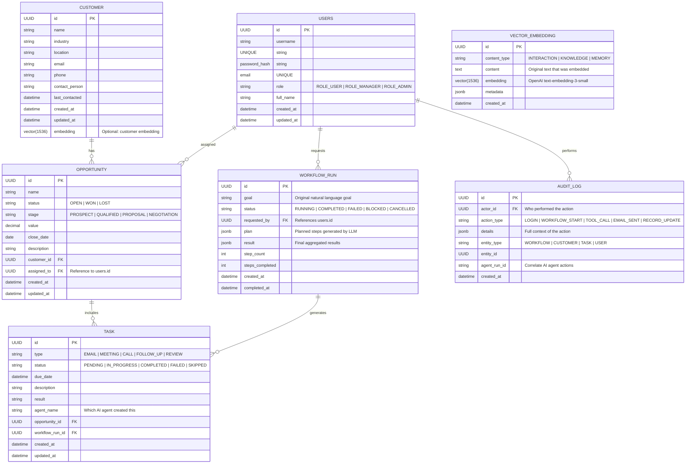

# 🏛️ AtlasAI — Architecture Deep Dive

> **Project:** AtlasAI — Agentic Sales Workflow Automation Platform
> **Date:** July 2026
> **Status:** Phase 01 Complete (Design Phase)

---

## 📋 Table of Contents

1. [System Overview](#-system-overview)
2. [Backend Architecture (Java/Spring Boot)](#-backend-architecture)
   - [Service Topology](#service-topology)
   - [Communication Patterns](#communication-patterns)
   - [Sync Flow Example](#sync-flow-example)
   - [Async Flow Example](#async-flow-example)
   - [API Gateway Role](#api-gateway-role)
   - [Resilience & Error Handling](#resilience--error-handling)
3. [Database Architecture](#-database-architecture)
   - [Schema Design](#schema-design)
   - [PostgreSQL Deep Dive](#postgresql-deep-dive)
   - [Redis Usage](#redis-usage)
   - [Kafka Event Schema Strategy](#kafka-event-schema-strategy)
4. [Frontend Architecture (React + TypeScript)](#-frontend-architecture)
   - [Page & Component Map](#page--component-map)
   - [State Management Strategy](#state-management-strategy)
   - [API Integration Pattern](#api-integration-pattern)
   - [Real-Time Updates](#real-time-updates)
5. [AI Agent Architecture](#-ai-agent-architecture)
   - [Agent Hierarchy & Responsibilities](#agent-hierarchy--responsibilities)
   - [Orchestrator Agent — Detailed Workflow](#orchestrator-agent--detailed-workflow)
   - [RAG & Memory Architecture](#rag--memory-architecture)
   - [Framework Choice: OpenAI Agents SDK vs LangGraph](#framework-choice)
6. [End-to-End Data Flow](#-end-to-end-data-flow)
7. [Security Architecture](#-security-architecture)
8. [Observability Stack](#-observability-stack)
9. [Key Architecture Decisions](#-key-architecture-decisions)

---

## 🌐 System Overview

```
                    ┌──────────────────────────────────────────┐
                    │            React/TypeScript SPA           │
                    │            (Port 3000)                    │
                    └────────────────┬─────────────────────────┘
                                     │ HTTPS
                    ┌────────────────▼─────────────────────────┐
                    │       Spring Cloud Gateway (Port 8080)     │
                    │     Auth · Routing · Rate Limiting (Redis) │
                    └──┬──┬──┬──┬──┬──┬──┬──┬──────────────────┘
                       │  │  │  │  │  │  │  │
        ┌──────────────┼──┼──┼──┼──┼──┼──┼──┼──────────────┐
        ▼              ▼  ▼  ▼  ▼  ▼  ▼  ▼  ▼               ▼
   ┌─────────┐ ┌────────┐┌──────┐┌────┐┌────────┐┌──────────┐
   │ Auth    │ │Customer ││Work- ││Task││Notifi- ││ Search   │
   │ Service │ │Service  ││flow  ││Svc ││cation   ││ Service  │
   │ :8081   │ │:8082    ││:8083 ││:8084││:8085    ││ :8086    │
   └────┬────┘ └────┬────┘└──┬───┘└──┬──┘└────┬───┘└────┬────┘
        │           │        │       │        │         │
        ▼           ▼        ▼       ▼        ▼         ▼
   ┌──────────────────────────────────────────────────────────┐
   │                 Apache Kafka (Event Bus)                  │
   │  Topics: workflow.requests, workflow.started,            │
   │          workflow.step.completed, workflow.completed,    │
   │          task.created, email.sent, email.delivered,      │
   │          customer.updated, audit.log                     │
   └──────────────────────────────────────────────────────────┘
        │           │        │       │        │         │
        ▼           ▼        ▼       ▼        ▼         ▼
   ┌──────────────────────────────────────────────────────────┐
   │              ⚙️ AI Agent Service (Python)                 │
   │               (Port 8087)                                 │
   │  ┌────────────────────────────────────────────────────┐  │
   │  │  🧠 Orchestrator Agent                              │  │
   │  │  📇 CRM Agent  📧 Email Agent  📅 Calendar Agent   │  │
   │  │  🔍 RAG Agent                                       │  │
   │  └────────────────────────────────────────────────────┘  │
   │              │                                            │
   │              ▼                                            │
   │      OpenAI API (GPT-4o-mini / GPT-4 Turbo)              │
   └──────────────────────────────────────────────────────────┘
        │           │        │       │        │         │
        ▼           ▼        ▼       ▼        ▼         ▼
   ┌──────────────────────────────────────────────────────────┐
   │                  Data Layer                               │
   │  ┌──────────┐  ┌──────────┐  ┌──────────────────────┐   │
   │  │PostgreSQL│  │  Redis   │  │  Object Storage      │   │
   │  │+pgvector │  │  Cache   │  │  (S3 / MinIO)        │   │
   │  │ :5432    │  │ :6379    │  │                       │   │
   │  └──────────┘  └──────────┘  └──────────────────────┘   │
   └──────────────────────────────────────────────────────────┘
```

---

## ⚙️ Backend Architecture

### Service Topology

Seven microservices communicate through a mix of synchronous REST calls and asynchronous Kafka events:

| Service | Port | Language | Data Store | Purpose |
|---------|------|----------|------------|---------|
| **Auth Service** | 8081 | Java 21 / Spring Boot | PostgreSQL | OAuth2/JWT login, user management, RBAC |
| **Customer/CRM Service** | 8082 | Java 21 / Spring Boot | PostgreSQL + Redis | Customer & opportunity CRUD, search APIs |
| **Workflow Service** | 8083 | Java 21 / Spring Boot | PostgreSQL | Workflow lifecycle, Kafka event orchestration |
| **Task Service** | 8084 | Java 21 / Spring Boot | PostgreSQL | AI-generated task CRUD, status tracking |
| **Notification Service** | 8085 | Java 21 / Spring Boot | Kafka + Mail APIs | Email sending, calendar integration |
| **Search/Vector Service** | 8086 | Java 21 / Spring Boot | PostgreSQL (pgvector) | Vector embeddings, semantic search, RAG |
| **AI Agent Service** | 8087 | Python 3.11+ | PostgreSQL + Redis + OpenAI | Agent orchestration, tool execution, LLM calls |

### Communication Patterns

| Pattern | Technology | When Used | Rationale |
|---------|-----------|-----------|-----------|
| **Synchronous (REST)** | Spring Boot `RestClient` / OpenFeign | Auth validation, quick queries (e.g., list customers) | Immediate response needed |
| **Asynchronous (Events)** | Spring Cloud Stream + Apache Kafka | Long-running workflows, cross-service updates, audit logging | Decouples services, enables replayability |
| **Resilience** | Resilience4j (circuit breaker, retries, rate limiter) | All external API calls | Prevents cascading failures, handles transient errors |
| **Caching** | Spring Cache abstraction backed by Redis | Customer queries, session data, frequent lookups | Reduces DB load, improves latency |

### Sync Flow Example

```
Frontend → Gateway → Auth Service (validate JWT) → Customer Service → PostgreSQL → Response
```

**When to use sync:** The user needs an immediate answer — listing customers, checking workflow status, getting task details.

### Async Flow Example (Workflow Execution)

```
1. User submits goal
   → Frontend POST /api/workflow { goal, parameters }
   
2. Workflow Service
   → @Transactional: Creates WorkflowRun record (status=RUNNING) in PostgreSQL
   → Publishes to Kafka: workflow.started { workflowId, goal, requestedBy }
   
3. AI Agent Service (Python)
   → Kafka consumer receives workflow.started
   → Orchestrator Agent plans execution:
     a. Calls Customer Service (REST): search_customers(industry, location, days)
     b. Calls Notification Service (REST): send_email(to, subject, body)
     c. Publishes workflow.step.completed for each step
     
4. Task Service
   → Kafka consumer creates Task records from agent steps
   → Stores in PostgreSQL for user to view and manage
   
5. Completion
   → AI Agent publishes workflow.completed to Kafka
   → Workflow Service consumes, updates status to COMPLETED
   → Audit log entry written to audit_logs table
   → Frontend displays: "5 emails sent, 3 meetings scheduled"
```

**Why async for workflows:** The agent may take 30+ seconds to plan and execute. Async decoupling means the frontend doesn't block. Multiple workflows can run in parallel. Failed steps can be retried without affecting other workflows.

### API Gateway Role

The **Spring Cloud Gateway** handles all cross-cutting concerns so individual microservices don't have to:

| Concern | Implementation | Details |
|---------|---------------|---------|
| **JWT Validation** | Spring Security OAuth2 Resource Server | Validates tokens before requests reach services |
| **Rate Limiting** | Redis-backed `RequestRateLimiter` | Per-user/role limits to control LLM API costs |
| **Routing** | Route predicates + filters | `/api/auth/**` → auth-service, `/api/customers/**` → customer-service |
| **Request Transformation** | Custom GatewayFilter factories | Adds `X-User-Id`, `X-User-Role` headers for downstream services |
| **CORS** | Global CORS configuration | Allows frontend origin |

**Deployment note:** In production, TLS termination and advanced traffic management can be offloaded to a **service mesh** (Istio/Linkerd) while Gateway handles application-layer concerns.

### Resilience & Error Handling

```
┌─────────────────────────────────────────────────────┐
│              Resilience4j Layers                     │
├─────────────────────────────────────────────────────┤
│                                                       │
│  Retry (3 attempts, exponential backoff)              │
│     ↓ on failure                                      │
│  Circuit Breaker (50% failure → open for 30s)         │
│     ↓ on circuit open                                  │
│  Fallback method (return cached/empty response)       │
│     ↓                                                 │
│  Time Limiter (5s timeout for agent calls)            │
│                                                       │
└─────────────────────────────────────────────────────┘
```

**Kafka error handling:**
- **Dead Letter Queue (DLQ):** Poison messages go to `[topic]-DLT` for manual inspection
- **Idempotency:** Each message carries a unique ID; consumers de-duplicate via DB check
- **Retry topics:** Configurable retry topics with backoff for transient failures

---

## 💾 Database Architecture

### Schema Design



### PostgreSQL Deep Dive

| Feature | Usage | Configuration |
|---------|-------|---------------|
| **Primary DB** | All transactional data | ACID compliance, `SERIALIZABLE` isolation for critical operations |
| **pgvector** | Vector embeddings for RAG | `vector(1536)` column type for OpenAI embeddings |
| **HNSW Index** | Fast similarity search | `CREATE INDEX ON vector_embedding USING hnsw (embedding vector_l2_ops)` |
| **Partitioning** | Scale audit_logs by month | `PARTITION BY RANGE (created_at)` |
| **Full-Text Search** | Customer search | `GIN` index on `to_tsvector('english', name || ' ' || industry)` |

**Indexing Strategy:**

```sql
-- Primary lookups
CREATE INDEX idx_customer_industry_location ON customer(industry, location);
CREATE INDEX idx_customer_last_contacted ON customer(last_contacted);
CREATE INDEX idx_opportunity_status ON opportunity(status);
CREATE INDEX idx_workflow_run_status ON workflow_run(status);
CREATE INDEX idx_task_status_due ON task(status, due_date);
CREATE INDEX idx_audit_log_created ON audit_log(created_at DESC);

-- Vector search
CREATE INDEX idx_embedding_hnsw ON vector_embedding 
  USING hnsw (embedding vector_cosine_ops) 
  WITH (m = 16, ef_construction = 200);

-- Full-text search
CREATE INDEX idx_customer_fts ON customer 
  USING GIN (to_tsvector('english', name || ' ' || industry || ' ' || location));
```

**HNSW Tuning Parameters:**

| Parameter | Value | Effect |
|-----------|-------|--------|
| `m` | 16 | Edge per node; higher = more accuracy, more memory |
| `ef_construction` | 200 | Build-time search breadth; higher = better quality, slower build |
| `ef_search` | 40 (query-time) | Search breadth; adjust up for better recall, down for lower latency |

### Redis Usage

| Use Case | Pattern | Key Structure | TTL |
|----------|---------|---------------|-----|
| **Session Cache** | `@Cacheable` on user sessions | `user:session:{userId}` | 1 hour |
| **JWT Revocation** | TTL-based blacklist | `jwt:blacklist:{jti}` | Until token expiry |
| **Rate Limiting** | Sliding window counter | `ratelimit:{userId}:{endpoint}` | 1 minute |
| **Frequent Queries** | `@Cacheable` on customer search | `customer:search:{industry}:{location}` | 5 minutes |
| **Idempotency Keys** | Set on processed events | `event:processed:{eventId}` | 24 hours |
| **Agent Context Cache** | Temporary state for running agents | `agent:context:{workflowId}` | Until workflow completion |

### Kafka Event Schema Strategy

Using **Schema Registry** (Avro or JSON Schema) to enforce event contracts across services:

```json
// Topic: workflow.started
{
  "schema": {
    "type": "object",
    "properties": {
      "workflowId":       { "type": "string", "format": "uuid" },
      "goal":             { "type": "string" },
      "requestedBy":      { "type": "string", "format": "uuid" },
      "parameters":       { "type": "object" },
      "timestamp":        { "type": "string", "format": "date-time" }
    },
    "required": ["workflowId", "goal", "requestedBy", "timestamp"]
  }
}

// Topic: workflow.step.completed
{
  "schema": {
    "type": "object",
    "properties": {
      "workflowId":       { "type": "string" },
      "stepNumber":       { "type": "integer" },
      "toolName":         { "type": "string" },
      "status":           { "type": "string", "enum": ["SUCCESS", "FAILED", "SKIPPED"] },
      "input":            { "type": "object" },
      "output":           { "type": "object" },
      "errorDetail":      { "type": "string" },
      "timestamp":        { "type": "string", "format": "date-time" }
    },
    "required": ["workflowId", "stepNumber", "toolName", "status", "timestamp"]
  }
}

// Topic: email.sent
{
  "schema": {
    "type": "object",
    "properties": {
      "emailId":          { "type": "string", "format": "uuid" },
      "workflowId":       { "type": "string", "format": "uuid" },
      "customerIds":      { "type": "array", "items": { "type": "string" } },
      "status":           { "type": "string", "enum": ["SENT", "DELIVERED", "BOUNCED", "FAILED"] },
      "errorDetail":      { "type": "string" },
      "timestamp":        { "type": "string", "format": "date-time" }
    },
    "required": ["emailId", "workflowId", "customerIds", "status", "timestamp"]
  }
}
```

**Why this matters:** Each microservice is maintained independently. The Schema Registry ensures that if the Notification Service changes its `email.sent` schema, consumers detect the incompatibility at deserialization time rather than silently corrupting data.

---

## 🎨 Frontend Architecture

### Page & Component Map

```
App.tsx
├── AuthProvider (React Context — JWT, user profile, login/logout)
├── TanStack QueryClientProvider (server state management)
├── BrowserRouter
│   ├── /login → LoginPage
│   │   └── LoginForm (React Hook Form + validation)
│   │
│   ├── / → AppLayout (authenticated routes)
│   │   ├── Sidebar (nav links, user avatar, logout)
│   │   ├── Header (breadcrumb, notifications bell)
│   │   └── <Outlet /> (React Router nested routes)
│   │       │
│   │       ├── /dashboard → DashboardPage
│   │       │   ├── MetricsCards (workflows this week, tasks completed,
│   │       │   │                  emails sent, meetings scheduled)
│   │       │   ├── RecentWorkflowsTable
│   │       │   └── PendingTasksList
│   │       │
│   │       ├── /workflows → WorkflowListPage
│   │       │   ├── StatusFilterTabs (All / Running / Completed / Failed)
│   │       │   └── WorkflowCardGrid
│   │       │       └── WorkflowCard (goal preview, status badge, progress bar, date)
│   │       │
│   │       ├── /workflows/create → CreateWorkflowPage
│   │       │   ├── GoalInput (large textarea for natural language)
│   │       │   ├── ParameterPanel (collapsible)
│   │       │   │   ├── IndustrySelect
│   │       │   │   ├── LocationInput
│   │       │   │   └── DaysSinceContactSlider
│   │       │   └── SubmitButton → POST /api/workflow → navigate to detail
│   │       │
│   │       ├── /workflows/:id → WorkflowDetailPage
│   │       │   ├── WorkflowHeader (goal text, status badge, duration)
│   │       │   ├── StepTimeline
│   │       │   │   └── StepItem (step number, tool name, status icon,
│   │       │   │       input summary, output summary, duration)
│   │       │   ├── ResultReportCard (AI-generated summary)
│   │       │   └── ActionButtons (re-run, cancel, export)
│   │       │
│   │       ├── /customers → CustomerListPage
│   │       │   ├── SearchFilters (industry dropdown, location, date range)
│   │       │   ├── CustomerTable (sortable columns, paginated)
│   │       │   └── CustomerDetailDrawer (sidebar with full info + opportunities)
│   │       │
│   │       ├── /tasks → TaskListPage
│   │       │   ├── FilterTabs (Pending / In Progress / Completed / All)
│   │       │   └── TaskCardList
│   │       │       └── TaskCard (type badge, description, due date,
│   │       │           status, complete action button)
│   │       │
│   │       └── /admin → AdminPanel (MANAGER+ role)
│   │           ├── UserManagementTable (CRUD users)
│   │           ├── AuditLogViewer (searchable, filterable log table)
│   │           └── AgentMetricsDashboard (workflow success rate,
│   │               avg duration, token usage, cost estimates)
│   │
│   └── * → NotFoundPage
│
└── ErrorBoundary (catches unhandled React errors)
```

### State Management Strategy

```
┌─────────────────────────────────────────────────────────────┐
│                    State Architecture                        │
├─────────────────────────────────────────────────────────────┤
│                                                               │
│  🔵 Server State (TanStack Query)                             │
│     - Fetch customers, workflows, tasks, metrics              │
│     - Auto-refetch on interval for active workflows           │
│     - Optimistic updates for task completion                  │
│     - Cache invalidation on mutations                         │
│                                                               │
│  🟢 URL State (React Router + nuqs)                           │
│     - Search filters: ?industry=Healthcare&location=Chennai   │
│     - Pagination: ?page=2&pageSize=20                         │
│     - Active tabs: ?tab=pending                               │
│     - Shareable, bookmarkable URLs                            │
│                                                               │
│  🟡 Global Client State (Zustand)                             │
│     - Auth store: { token, user, isAuthenticated, login,      │
│                     logout, refreshToken }                    │
│     - UI store: { sidebarOpen, theme, activeWorkflowId }      │
│                                                               │
│  ⚪ Local State (useState / useReducer)                       │
│     - Form input values                                       │
│     - Dropdown open/close                                     │
│     - Component-internal toggles                              │
│                                                               │
└─────────────────────────────────────────────────────────────┘
```

### API Integration Pattern

All API calls go through **TanStack Query** with TypeScript types generated from the backend OpenAPI spec:

```typescript
// Generated from backend OpenAPI spec (via openapi-typescript-codegen)
interface Customer {
  id: string;
  name: string;
  industry: string;
  location: string;
  email: string;
  lastContacted: string;
}

interface WorkflowRun {
  id: string;
  goal: string;
  status: 'RUNNING' | 'COMPLETED' | 'FAILED' | 'BLOCKED';
  plan: Record<string, unknown>;
  result: Record<string, unknown> | null;
  stepCount: number;
  stepsCompleted: number;
  createdAt: string;
  completedAt: string | null;
}

// Custom hooks for each domain
function useCustomers(filters: CustomerFilters) {
  return useQuery({
    queryKey: ['customers', filters],
    queryFn: () => axios.get('/api/customers', { params: filters }),
    staleTime: 30_000, // 30s before automatic refetch
    keepPreviousData: true, // smooth pagination transitions
  });
}

function useCreateWorkflow() {
  const queryClient = useQueryClient();
  return useMutation({
    mutationFn: (goal: string) => axios.post('/api/workflow', { goal }),
    onSuccess: () => {
      queryClient.invalidateQueries({ queryKey: ['workflows'] });
    },
  });
}

function useWorkflowStatus(id: string) {
  return useQuery({
    queryKey: ['workflow', id],
    queryFn: () => axios.get(`/api/workflow/${id}`),
    refetchInterval: (query) => 
      query.state.data?.status === 'RUNNING' ? 3000 : false, // poll only when running
  });
}
```

### Real-Time Updates

**Strategy for live workflow progress:**

| Method | Implementation | Pros | Cons |
|--------|---------------|------|------|
| **Polling** (MVP) | TanStack Query `refetchInterval: 3000` | Simple, no server changes needed | Wasted requests for idle users |
| **Server-Sent Events** (Post-MVP) | Spring WebFlux `SseEmitter` + React `EventSource` | Unidirectional, lightweight | No built-in reconnection logic |
| **WebSocket** (Post-MVP) | Spring WebSocket + React `useWebSocket` | Bidirectional, real-time | More complex infrastructure |

**Recommended:** Start with **polling** (it's free with TanStack Query's `refetchInterval`). Add SSE or WebSocket if polling becomes a bottleneck.

---

## 🤖 AI Agent Architecture

### Agent Hierarchy & Responsibilities

```
                    ┌──────────────────────────────────────────────┐
                    │          🧠 Orchestrator Agent                │
                    │           (Planner + Coordinator)              │
                    │                                                │
                    │  Responsibilities:                             │
                    │  • Receives user goal from Workflow Service    │
                    │  • LLM generates step-by-step execution plan   │
                    │  • Delegates steps to tool/specialist agents   │
                    │  • Monitors progress & updates status          │
                    │  • Validates intermediate results              │
                    │  • Handles errors (retry, skip, or fail)       │
                    │  • Compiles final report                       │
                    └──────┬──────────────┬──────────────┬──────────┘
                           │              │              │
              ┌────────────┼──────────────┼──────────────┼──────────────┐
              ▼            ▼              ▼              ▼              ▼
    ┌──────────────┐ ┌──────────────┐ ┌──────────────┐ ┌──────────────┐
    │ 📇 CRM Agent  │ │  📧 Email    │ │  📅 Calendar │ │  🔍 RAG      │
    │               │ │  Agent       │ │  Agent       │ │  Agent       │
    ├───────────────┤ ├──────────────┤ ├──────────────┤ ├──────────────┤
    │ Searches      │ │ Drafts       │ │ Checks       │ │ Retrieves    │
    │ customers     │ │ personalized │ │ availability │ │ relevant     │
    │ in DB         │ │ follow-up    │ │ Schedules    │ │ context from │
    │ Updates       │ │ emails       │ │ meetings     │ │ vector store │
    │ records       │ │ Sends via    │ │ Sends        │ │ Augments     │
    │               │ │ SendGrid/SMTP│ │ invites      │ │ LLM prompts  │
    └──────┬───────┘ └──────┬───────┘ └──────┬───────┘ └──────┬───────┘
           │               │                │                │
           ▼               ▼                ▼                ▼
    ┌──────────┐    ┌──────────┐    ┌──────────┐    ┌──────────┐
    │Customer  │    │SendGrid  │    │Google    │    │pgvector  │
    │Service   │    │/SMTP     │    │Calendar  │    │Store     │
    │(REST API)│    │(REST API)│    │(REST API)│    │(SQL)     │
    └──────────┘    └──────────┘    └──────────┘    └──────────┘
```

### Orchestrator Agent — Detailed Workflow

**Step 1: Goal Reception**

```
User: "Follow up with healthcare leads in Chennai"

WorkflowService receives: POST /api/workflow
Payload: { goal: "Follow up with healthcare leads in Chennai" }

WorkflowService:
  1. Creates WorkflowRun in PostgreSQL (status = RUNNING)
  2. Publishes workflow.started to Kafka
  3. Calls AI Agent Service: POST /api/agent/start
     Payload: { workflowId, goal, context }
```

**Step 2: Planning (LLM Call)**

```
Agent receives: { workflowId: "abc-123", goal: "Follow up with healthcare leads in Chennai" }

System Prompt (Planner):
"""
You are a sales workflow planner for AtlasAI. Your task is to break down 
a sales goal into executable steps.

Available tools:
- search_customers(industry, location, minDaysSinceContact) → Customer[]
- send_email(to[], subject, body) → { sent: int, failed: int }
- schedule_meeting(customerId, preferredDate) → { scheduled: bool }
- update_crm_record(customerId, field, value) → { updated: bool }

For each step, specify:
1. The tool to call
2. The arguments
3. Expected output interpretation

Respond with a JSON array of steps.
"""

User Prompt:
"Goal: Follow up with healthcare leads in Chennai.
Break this down into actionable steps."

Expected LLM Response:
[
  {
    "step": 1,
    "tool": "search_customers",
    "arguments": {
      "industry": "Healthcare",
      "location": "Chennai",
      "minDaysSinceContact": 10
    },
    "description": "Find healthcare leads in Chennai not contacted in 10+ days"
  },
  {
    "step": 2,
    "tool": "send_email",
    "arguments": {
      "to": "{{from_step_1.emails}}",
      "subject": "Quick check-in from our team",
      "body": "{{generated_body}}"
    },
    "description": "Send personalized follow-up emails to each lead"
  },
  {
    "step": 3,
    "tool": "schedule_meeting",
    "arguments": {
      "customerId": "{{from_step_2.interested_customers}}",
      "preferredDate": "next_week"
    },
    "description": "Schedule meetings with respondents"
  },
  {
    "step": 4,
    "tool": "update_crm_record",
    "arguments": {
      "customerId": "{{all_processed}}",
      "field": "lastContacted",
      "value": "now"
    },
    "description": "Update CRM records with latest contact date"
  }
]
```

**Step 3: Execution (Tool Call Loop)**

For each step, the agent:

1. **Resolves template variables** (e.g., `{{from_step_1.emails}}`)
2. **Makes an LLM function call** to determine exact parameters
3. **Executes the tool** (calls the corresponding backend API)
4. **Stores the result** in a shared context dict
5. **Publishes a Kafka event** for the step completion
6. **Updates workflow progress**

```json
// Step 1 Tool Call — Search Customers
{
  "name": "search_customers",
  "arguments": "{\"industry\": \"Healthcare\", \"location\": \"Chennai\", \"minDaysSinceContact\": 10}"
}

// → Agent calls: GET /api/customers/search?industry=Healthcare&location=Chennai&days=10
// → Customer Service returns:
[
  { "id": "c001", "name": "Acme Hospital", "email": "contact@acme.com", "contactPerson": "Dr. Sharma" },
  { "id": "c002", "name": "MediPlus Clinics", "email": "info@mediplus.in", "contactPerson": "Ms. Patel" },
  { "id": "c003", "name": "HealthFirst Labs", "email": "lab@healthfirst.com", "contactPerson": "Mr. Kumar" }
]

// Step 2 Tool Call — Send Email (after LLM generates personalized bodies)
{
  "name": "send_email",
  "arguments": "{\"to\": [\"contact@acme.com\", \"info@mediplus.in\", \"lab@healthfirst.com\"], \"subject\": \"Following up on your recent inquiry\", \"body\": \"Dear Dr. Sharma, I wanted to check in...\"}"
}

// → Agent calls: POST /api/notifications/email
// → Notification Service returns:
{ "sent": 3, "failed": 0 }
```

**Step 4: Result Aggregation & Reporting**

```
After all steps complete:

1. Agent collects all step results
2. Publishes workflow.completed { workflowId, result }
3. WorkflowService updates DB status to COMPLETED
4. Audit log entry written

User sees on frontend:
  ✅ 3 customers found
  ✅ 3 personalized emails sent
  ✅ 0 failed deliveries
  ✅ CRM records updated
  📊 Summary: Follow-up initiated for 3 healthcare leads in Chennai
```

### RAG & Memory Architecture

```
User Query / Agent Context
          │
          ▼
    ┌─────────────┐
    │ Embedding    │ ← OpenAI text-embedding-3-small (1536 dimensions)
    │ Model        │
    └──────┬──────┘
           │ vector
           ▼
    ┌─────────────┐
    │ pgvector     │ ← HNSW index (cosine similarity)
    │ PostgreSQL   │
    │              │
    │ Stores:      │
    │ - Past interactions & emails                          │
    │ - Sales playbooks & templates                         │
    │ - Agent memory (previous workflow context)            │
    │ - Product knowledge base                              │
    └──────┬──────┘
           │ relevant chunks (top-k = 5)
           ▼
    ┌─────────────┐
    │ LLM Prompt  │ ← Augmented with retrieved context
    │ Builder     │
    │             │
    │ "Based on the retrieved context, generate a            │
    │  personalized follow-up email for {customer}..."       │
    └──────┬──────┘
           │ augmented prompt
           ▼
    ┌─────────────────┐
    │ GPT-4o-mini      │ ← Smaller, cheaper model for routine tasks
    │ (execution)      │
    │ GPT-4 Turbo      │ ← Larger model for complex planning
    │ (planning)       │
    └─────────────────┘
```

**Embedding Strategy:**

| Content Type | What Gets Embedded | Refresh Frequency |
|-------------|-------------------|-------------------|
| **Customer Interactions** | Past emails, meeting notes, call transcripts | On each new interaction |
| **Sales Playbooks** | Company sales templates, best practices, battle cards | On update |
| **Agent Memory** | Past workflow results, user preferences, context | On each workflow completion |
| **Product Knowledge** | Product docs, features, pricing | On update |

**Retrieval Flow:**

```python
def augment_prompt_with_context(goal: str, user_id: str) -> str:
    # 1. Generate embedding for the user's goal
    goal_embedding = openai.embeddings.create(
        input=goal,
        model="text-embedding-3-small"
    ).data[0].embedding

    # 2. Search pgvector for relevant context
    results = vector_db.search(
        embedding=goal_embedding,
        filters={"user_id": user_id},
        top_k=5,
        min_similarity=0.7
    )

    # 3. Build augmented prompt
    context = "\n\n".join([r.content for r in results])
    
    return f"""
    Context from previous interactions:
    {context}
    
    Based on this context and the goal, generate a plan.
    Goal: {goal}
    """
```

### Framework Choice

| Factor | AtlasAI's Situation | Recommended |
|--------|-------------------|-------------|
| **Workflow Complexity** | Linear planning → execution → report | **OpenAI Agents SDK** — loop-based execution is sufficient |
| **State Management** | Workflow state in PostgreSQL + Kafka | No need for built-in agent checkpointing |
| **Vendor Lock-in** | Already committed to OpenAI | SDK is optimized for OpenAI function calling |
| **Audit Trail** | Kafka events + audit_logs table = external audit | Don't need LangGraph's built-in state machine |
| **Team** | Python service calling REST APIs | SDK is minimal, easy to maintain, fast to iterate |

**Decision:** Start with **OpenAI Agents SDK** for its simplicity and tight OpenAI integration.

**When to migrate to LangGraph:**

- Cyclical workflows (agent re-plans based on intermediate results)
- Parallel agent execution (multiple agents running simultaneously)
- Human-in-the-loop approval gates mid-workflow
- Need to switch between multiple LLM providers (OpenAI, Anthropic, local models)

---

## 🔄 End-to-End Data Flow

Here's the complete journey of a single workflow request through every system component:

```
1. USER ACTION
   User types: "Follow up with healthcare leads in Chennai"
   → CreateWorkflowPage.tsx
   → Form validation via React Hook Form
   
2. FRONTEND STATE
   → Zustand: reads JWT from auth store
   → TanStack Query: useCreateWorkflow mutation fires
   → Axios: POST /api/workflow { goal: "..." }
     Header: Authorization: Bearer <jwt>
   
3. API GATEWAY (Spring Cloud Gateway)
   → Route: /api/workflow → workflow-service:8083
   → Filter: validate JWT via Auth Service (REST call)
   → Filter: check rate limit via Redis
   → Filter: add X-User-Id, X-User-Role headers
   → Forward request to Workflow Service
   
4. WORKFLOW SERVICE
   → Controller: @PostMapping("/api/workflow")
   → @Transactional:
     1. Extract user from Security Context
     2. Create WorkflowRun { id, goal, status: RUNNING, requestedBy }
     3. Save to PostgreSQL
   → Kafka: publish workflow.started { workflowId, goal, requestedBy }
   → REST: POST /api/agent/start { workflowId, goal, context }
     (Python AI Agent Service)
   
5. AI AGENT SERVICE (Python)
   → FastAPI endpoint receives request
   → Orchestrator Agent:
     1. LLM Call (GPT-4 Turbo): Generate plan from goal
     2. Store plan in workflow context
     3. For each step:
        a. Resolve arguments
        b. Call tool (REST API to appropriate microservice)
        c. Publish workflow.step.completed to Kafka
        d. Update workflow run with step result
     4. Aggregate results
     5. Publish workflow.completed to Kafka
   
6. KAFKA EVENT BUS
   workflow.started → consumed by: Task Service, Audit Log Writer
   workflow.step.completed → consumed by: Workflow Service (DB update)
   workflow.completed → consumed by: Workflow Service (finalize DB)
   email.sent → consumed by: Task Service (create Task records)

7. TASK SERVICE
   → Kafka: consumes email.sent, task.created
   → Creates/updates Task records in PostgreSQL
   
8. AUDIT LOG (append-only)
   → Listens to all Kafka topics
   → Writes immutable audit_log records
   
9. FRONTEND (Polling)
   → TanStack Query: refetchInterval=3000 on active workflow
   → GET /api/workflow/{id} returns current status + step results
   → UI updates in real-time with progress bar and step timeline
   
10. COMPLETION
    → Frontend receives status=COMPLETED
    → Displays final summary card
    → User sees: "✅ 5 emails sent, 3 meetings scheduled"
    → Workflow detail remains viewable with full step history
```

---

## 🔒 Security Architecture

| Layer | Measure | Implementation |
|-------|---------|---------------|
| **Authentication** | OAuth2 with JWT | Spring Security OAuth2 Resource Server; JWT contains user ID, role, expiry |
| **Authorization** | Role-Based Access Control | `@PreAuthorize("hasRole('MANAGER')")` on endpoints; 3 roles: USER, MANAGER, ADMIN |
| **Transport Security** | TLS/HTTPS | K8s Ingress with cert-manager; all inter-service HTTP over TLS |
| **Secrets Management** | Environment variables → K8s Secrets | Never hardcode secrets; Vault for production |
| **Input Validation** | Sanitized user inputs | Frontend validation + backend `@Valid` + AI content filters |
| **Audit Trail** | Append-only audit logs | Every agent action recorded with actor, action, entity, timestamp |
| **Rate Limiting** | Per-user, per-API | Redis-backed sliding window; prevents LLM cost abuse |
| **Data Privacy** | PII isolation | Only CRM Service has direct DB access to customer PII; other services call via API |

### JWT Structure

```json
{
  "sub": "user-id-123",
  "email": "salesrep@company.com",
  "roles": ["ROLE_USER"],
  "iat": 1782921600,
  "exp": 1782925200,
  "jti": "unique-token-id"
}
```

### RBAC Matrix

| Endpoint | USER | MANAGER | ADMIN |
|----------|------|---------|-------|
| `POST /api/workflow` | ✅ | ✅ | ✅ |
| `GET /api/tasks` | ✅ | ✅ | ✅ |
| `GET /api/customers` | ✅ | ✅ | ✅ |
| `GET /api/analytics` | ❌ | ✅ | ✅ |
| `GET /api/users` | ❌ | ❌ | ✅ |
| `GET /api/audit-logs` | ❌ | ✅ | ✅ |

---

## 📊 Observability Stack

| Component | Tool | What It Monitors |
|-----------|------|-----------------|
| **Metrics** | Prometheus + Micrometer | Request counts, latencies, error rates, JVM metrics, Kafka consumer lag |
| **Dashboards** | Grafana | Workflow throughput, agent success rate, token usage, service health |
| **Tracing** | OpenTelemetry + Jaeger | End-to-end trace of a single workflow through all services |
| **Logging** | ELK Stack (Elasticsearch, Logstash, Kibana) | Structured JSON logs, searchable by request ID |
| **Agent Observability** | Custom dashboard | Active agent sessions, step completion rates, LLM token consumption |
| **Alerts** | Grafana Alerting | Workflow failure rate > 5%, Kafka consumer lag > 1000, LLM latency > 10s |

**Custom Metrics (Micrometer):**

```java
@Bean
public MeterRegistryCustomizer<MeterRegistry> metricsCommonTags() {
    return registry -> registry.config().commonTags("application", "workflow-service");
}

// Custom counters
Counter workflowsStarted = Counter.builder("workflows.started")
    .description("Total workflows started")
    .register(meterRegistry);

Counter workflowsCompleted = Counter.builder("workflows.completed")
    .tag("status", "SUCCESS")
    .register(meterRegistry);

Timer agentLatency = Timer.builder("agent.llm.latency")
    .description("LLM call latency")
    .register(meterRegistry);
```

---

## 🎯 Key Architecture Decisions

| Decision | Choice | Rationale |
|----------|--------|-----------|
| **Communication Model** | REST (sync) + Kafka (async) | Synchronous for queries needing immediate response; async for long-running workflows |
| **API Gateway** | Spring Cloud Gateway | Reactive foundation, built-in OAuth2/OIDC, Redis rate limiting, routing |
| **Frontend State** | TanStack Query + Zustand + URL state | Server state ≠ global state ≠ UI state — each managed with the right tool |
| **Agent Framework** | OpenAI Agents SDK (start), LangGraph (if needed) | Simpler to prototype; migrate if complex branching/human-in-loop needed |
| **Vector Database** | pgvector in PostgreSQL | No new infrastructure; ACID guarantees; good to ~50M vectors |
| **AI Model Tiering** | GPT-4 Turbo (planning) + GPT-4o-mini (execution) | Cost optimization: small model for routine tasks, powerful model for reasoning |
| **Event Schemas** | Schema Registry (Avro) | Enforce contracts between independently deployed services |
| **Caching** | Redis via Spring Cache | Single cache for rate limiting, JWT revocation, session caching, and data caching |
| **Container Orchestration** | Docker Compose (dev) → Kubernetes (prod) | Same containers, different orchestration; minimal config changes |
| **Observability** | OpenTelemetry + Prometheus + Grafana + ELK | Industry standard, open-source, works across Java and Python services |
| **Build Tool** | Maven | Already installed; widely adopted for Spring Boot; works well with multi-module projects |
| **Java Version** | 21 LTS | Latest LTS; pattern matching, records, virtual threads (for I/O-heavy agent calls) |

---

## 📚 Related Documents

- [`README.md`](./README.md) — Full project documentation, getting started guide, roadmap
- [`PHASE01-ATLAS.md`](./PHASE01-ATLAS.md) — Phase 01 completion tracking (prerequisites, Docker images, env setup)
- [`deep-research-report.md`](./deep-research-report.md) — Comprehensive 13-section research & design document
- [`.env`](./.env) — Environment variables (placeholder values — fill real secrets)
