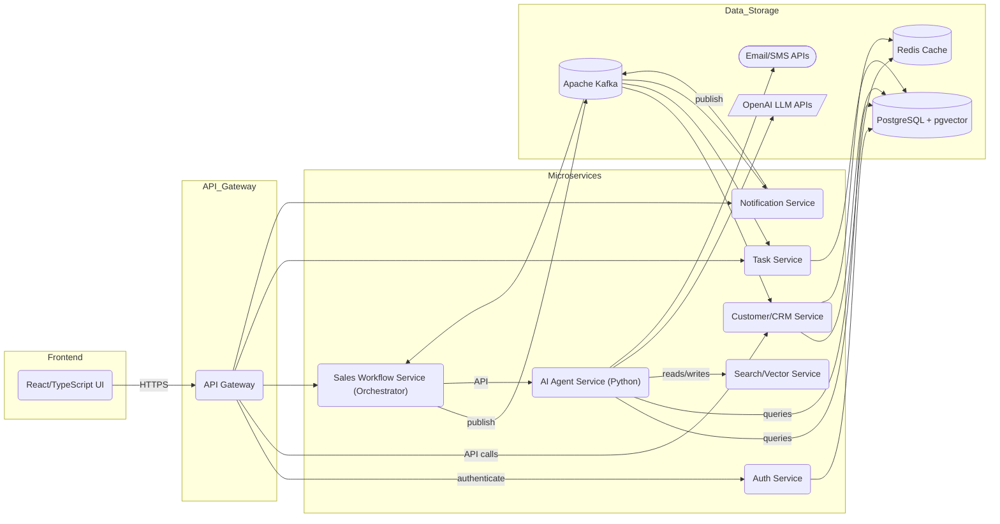
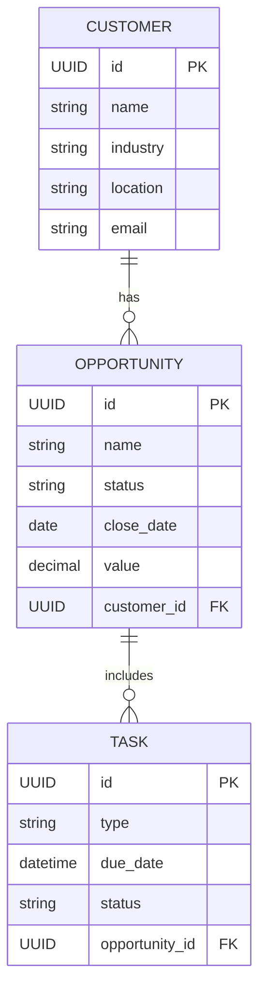
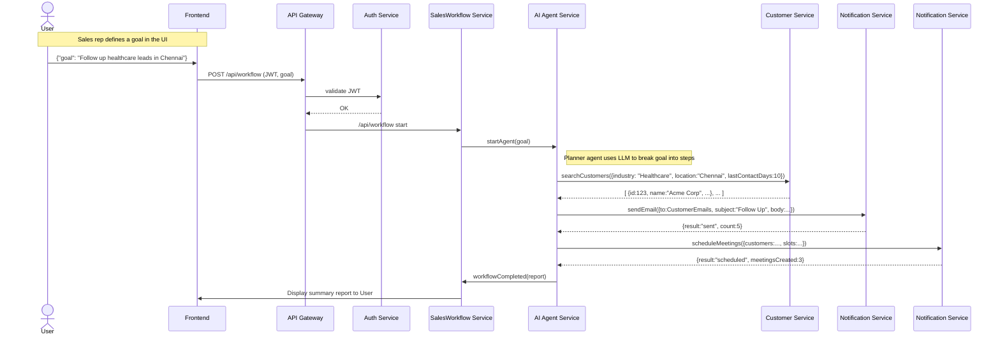

# Executive Summary

**AtlasAI** is an *Agentic Sales Workflow Automation Platform* designed to let enterprise sales teams delegate complex, multi-step tasks to AI agents. Sales reps and managers can issue high-level goals (e.g. “Follow up with healthcare leads in Chennai”), and the system’s AI “orchestrator” agent will autonomously query CRM data, draft emails, schedule meetings, update records, and report outcomes. This approach mirrors Salesforce’s **Agentforce** vision of AI agents that *plan, act, and collaborate* across systems.  

Key benefits include dramatic time savings (automating hours of manual follow-up work), higher conversion rates (faster lead responses), and transparent AI oversight (auditable agent actions). Success metrics might include **tasks automated per week**, **lead response time reduction**, and **sales pipeline velocity increase**. The core users are sales representatives (who use a simple UI or chat interface to request actions) and sales managers/operations (who define policies and monitor agent performance). Typical personas include *a sales rep handling dozens of leads* and *a sales manager optimizing team workflows*.  

AtlasAI’s MVP will include: secure login, a UI for defining goals, an agentic backend that breaks down goals into subtasks (using LLM planning and tool calls), CRUD microservices for customer and task data, and email/calendar integration. Beyond MVP, we add advanced RAG-based memory, analytics dashboards, and production observability. All services will be built in **Java 21** with Spring Boot, using Postgres (+pgvector) and Redis, orchestrated with Kafka, and deployed with Docker/Kubernetes. The UI is **React+TypeScript**. This report details the product vision, architecture, agent design, technology stack, implementation plan, security, testing, and an 8-week roadmap. Citations to official sources and industry best practices are included throughout for validation.

## 1. Product Vision & PRD

- **Vision:** Empower sales teams by **automating routine sales workflows** through intelligent AI agents. Sales goals (e.g. “re-engage cold leads”) become high-level tasks; the system autonomously handles data lookup, communication, and record updates. This is *not* a static chatbot, but a delegation engine: a user asks *“What needs to be done?”* and agents execute multiple steps to deliver the outcome.

- **Users / Personas:**  
  - *Sales Representative*: Needs to automate follow-ups, lead nurturing tasks. Will use a dashboard or chat UI to trigger workflows.  
  - *Sales Manager*: Sets up business rules (e.g. contact windows, email templates) and monitors agent performance. Checks dashboards for KPI improvements.  
  - *Ops/IT Admin*: Installs and configures the platform, manages integrations, and reviews audit logs for compliance.  

- **Core Features (MVP):**  
  - **Goal-Oriented Task Creation:** User enters a sales goal (natural language).  
  - **Agentic Orchestrator:** AI planner agent decomposes the goal into subtasks (e.g. “find leads”, “send follow-up email”, “schedule meeting”, “update CRM”).  
  - **Tool Agents:** Specialized agents or modules carry out each step (CRM lookup, email API, calendar API, etc) via LLM tool calls or service endpoints.  
  - **Workflow Tracking:** Real-time status of each step, visible to user. Agents can ask for human input on uncertainties (guardrail).  
  - **Data Integration:** Access to CRM database (customers, opportunities), vector-augmented knowledge, and external APIs (email, calendar, etc.).  
  - **Security & Compliance:** OAuth2 login, role-based access, encrypted data, and full audit trail of AI actions.  

- **Success Metrics:**  
  - **Task Completion Rate:** % of workflows completed without human intervention.  
  - **Time Savings:** Reduction in manual task hours (measured by time logged vs. automation).  
  - **Conversion Lift:** Improvement in lead conversion rate or sales cycle time.  
  - **User Satisfaction:** Surveys (ease of use, perceived intelligence of AI).  
  - **Reliability:** % of agent decisions that comply with business rules (tracked via guardrail hits).  

## 2. Architecture Overview

AtlasAI uses a **microservices, event-driven architecture** with a clear separation of concerns and modern cloud-native infrastructure. The high-level components are:

- **Frontend:** React+TypeScript web app (or single-page app) for user interaction (login, dashboards, workflow creation).
- **API Gateway:** Central ingress (e.g. Spring Cloud Gateway) handling routing, auth token validation, rate limiting.
- **Microservices:** Multiple Spring Boot services (see diagram) such as Auth, Customer/CRM, SalesWorkflow (main orchestrator), Task, Notification, Analytics, and an AI-Agent service.  
- **Event Bus (Kafka):** An Apache Kafka cluster for asynchronous events (e.g. “workflow.start”, “customer.found”, “email.sent”) to decouple services and enable scalable pipelines.
- **Databases:**  
  - **PostgreSQL:** Primary RDBMS for structured data (customers, opportunities, tasks).  
  - **pgvector (Vector DB):** Extension on PostgreSQL (or a separate vector store) for embeddings (agent memory, RAG).  
  - **Redis:** In-memory cache/session store (e.g. caching frequent queries, JWT revocation, etc).  
  - **Object Storage:** (Optional) For storing large documents or logs (e.g. AWS S3 or MinIO).
- **LLM/API Endpoints:** Connections to OpenAI (or similar) models for text understanding and generation.  
- **Infrastructure:** Containerized deployment (Docker + Kubernetes). CI/CD pipelines (GitHub Actions). Monitoring and logging tools (Prometheus, Grafana, OpenTelemetry, ELK).
  
**Architecture Diagram:** A simplified component diagram (Mermaid) might look like this:



This shows the **API gateway** routing requests to services, the **services publishing/subscribing to Kafka topics**, and the **AI Agent** service orchestrating calls to OpenAI and backend services. We will also create a detailed **sequence diagram** for a sample workflow (see Section 2.2).

<details>
<summary><strong>Citations & References for Architecture</strong></summary>
Spring Boot microservices commonly use an API gateway and Kafka for events (see e.g. a reference demo [23] or Spring guides). The architecture above is guided by Salesforce’s agentic patterns: agents integrate tightly with CRM data and external tools.  
</details>

### 2.1 Database ER Diagram

A simplified **Mermaid ER diagram** for the core relational data might look like:



- **CUSTOMER**: Stores client accounts (fields: id, name, industry, location, contact info).  
- **OPPORTUNITY**: Sales deals, related to a customer (fields: id, name, stage/status, value, close date).  
- **TASK**: Follow-up tasks generated by agents (e.g. email send, meeting schedule) linked to an opportunity.  

Additional tables would include **User** (sales reps with roles), **AgentRun** (to track each AI-run workflow), etc. JPA entities (e.g. `CustomerEntity`, `OpportunityEntity`, `TaskEntity`) map directly to these tables, with appropriate indexes (e.g. on industry, on due_date) for efficient queries.

### 2.2 Sequence Flow (Example)

A typical sequence for a “Follow Up Leads” workflow might be:



This flow illustrates:
1. **User request** goes through UI→API Gateway→Workflow service.  
2. Workflow service invokes the **Agent service** (the orchestrator).  
3. **Agent (Planner)** prompts an LLM to decide steps (e.g. query CRM, send emails, schedule).  
4. **CRM Service** returns customer list.  
5. **Notification (Email/Calendar) Services** perform actions.  
6. Agent aggregates results and returns a **report**.  

Sequence diagrams and architecture charts help interviewer discussions about interactions, error paths (Agent might retry failed email sends), and data flows.

## 3. Agent Design

At the heart of AtlasAI are **AI agents** that decompose goals into actions. Following Salesforce’s Agentforce patterns, we’ll define several agent roles:

- **Orchestrator (Planner) Agent:** The top-level agent that owns the user’s goal. It **plans** the workflow: breaking the high-level objective into sub-tasks, choosing which specialized agents or tools to invoke for each step. The Orchestrator keeps track of state, progress, and compliance (guardrails).
- **Tool/Specialist Agents:** Perform concrete actions by calling services or APIs:
  - **CRM Agent:** Queries the Customer Service for data (e.g. “find leads matching criteria”).
  - **Email Agent:** Crafts and sends personalized emails (calling an email API or SMTP).
  - **Calendar Agent:** Schedules meetings (via Google/Microsoft Calendar API).
  - **Analytics Agent:** Summarizes outcomes (sales metrics, expected impact).
  - **Notification Agent:** Notifies humans if needed (via Slack/Teams).
- **Verifier Agent (optional):** Validates results against success criteria or compliance rules (e.g. ensuring no contact after certain hours). If a check fails, it can raise alerts or retry.

### 3.1 Planner/Executor Flow

A typical agent workflow (aligning with Salesforce guidelines) is:
1. **Goal Definition:** The Orchestrator agent receives the goal and context.
2. **Planning:** It generates a step-by-step plan (often via few-shot prompt to an LLM) specifying which tools/agents to use.  
3. **Execution:** For each step, the agent either calls a *tool* via OpenAI function-calling (see below) or invokes another “headless” agent. Each tool call is structured (JSON) and validated. Salesforce refers to these calls as **Actions** that the agent invokes.
4. **Monitoring:** After each step, the agent updates progress and can consult human-in-the-loop or guardrails if something seems off.
5. **Completion:** The agent compiles results and marks the workflow as done.

For example, a planner prompt might be:  
> “We have a CRM with customer data. **Goal:** ‘Identify all healthcare leads in Chennai who haven’t replied in 10 days, send each a follow-up email, and schedule a meeting for those who reply.’ List the steps you will take, including any API calls.”  

The Orchestrator LLM might plan:  
1. Search CRM for customers (industry=Healthcare, location=Chennai, lastContactDays ≥ 10).  
2. For each found customer, use the **Email Agent** to send a follow-up email.  
3. If customer responds, use **Calendar Agent** to schedule a meeting.  
4. Summarize results (number of emails sent, meetings scheduled).

This plan leads to **tool calls** like:

```json
{"name": "search_customers", "arguments": "{\"industry\": \"Healthcare\", \"location\": \"Chennai\", \"days_since_contact\": 10}"}
```

And after receiving customer list:
```json
{"name": "send_email", "arguments": "{\"to\": [\"alice@xyz.com\",\"bob@xyz.com\"], \"subject\": \"Quick follow-up\", \"body\": \"...\"}"}
```
Each tool-call JSON includes a function name and arguments as JSON-encoded string. OpenAI’s function-calling API will produce exactly this structure.

### 3.2 Retrieval-Augmented Generation (RAG) & Memory

To answer questions or generate content in context, agents will use **RAG (Retrieval-Augmented Generation)**. We’ll keep a vector database (pgvector) of embeddings for:
- CRM data (e.g. past interactions, policies).
- Domain knowledge (sales playbooks, product info).
- Conversation memory (past user interactions, for follow-up).

When the agent needs context, it first queries the vector store. Salesforce’s Data 360 concept uses a “vector store and RAG retrievers to provide a unified view of all relevant data”. Similarly, AtlasAI will embed relevant text into pgvector and use it to inform prompts. For example, before sending an email, the agent might retrieve previous email templates or last communication content from the vector store.

### 3.3 Prompt Templates & Schema

We define prompt templates for each agent role. For example:

- **Planner prompt:** “Given the sales goal *{goal}* and access to CRM and Email APIs, outline the steps to complete this objective. Respond with an ordered list of actions.”  
- **CRM Agent prompt:** “Find customers in the *{industry}* sector located in *{location}* who haven’t had contact in {days} days. Return a JSON array of customer IDs.”  
- **Email Agent prompt:** “Generate a personalized follow-up email for customer {name} at {company}, referencing their last purchase of {product}. Keep it under 100 words.”  

Each prompt may include system instructions to enforce business tone (e.g. always be professional) and specify the **JSON schema** of tool calls. OpenAI allows defining these schemas so the model output is structured (see [14]).

#### Sample Tool-Call JSON

Example of a function call JSON from an agent (taken from OpenAI docs):

```json
[
  {
    "id": "call_67890abc",
    "type": "function",
    "function": {
      "name": "send_email",
      "arguments": "{\"to\":[\"alice@xyz.com\",\"bob@xyz.com\"],\"subject\":\"Follow-up\",\"body\":\"Hi, just checking in...\"}"
    }
  }
]
```

In code, after receiving this response, we would parse `function.name` and `function.arguments` and execute the corresponding action in our system.

#### Kafka Event Schemas

We also define JSON schemas for internal Kafka events. For example:

- **Topic:** `workflow.requests`  
  **Schema:**  
  ```json
  {
    "workflowId": "UUID", 
    "requestedBy": "user123",
    "goal": "Follow up healthcare leads in Chennai",
    "timestamp": "2026-07-01T12:34:56Z",
    "parameters": {"industry": "Healthcare", "location": "Chennai", "daysSinceContact": 10}
  }
  ```
- **Topic:** `email.sent`  
  **Schema:**  
  ```json
  {
    "emailId": "UUID",
    "customerId": "cust-456",
    "status": "SENT",
    "timestamp": "2026-07-01T12:35:10Z"
  }
  ```
We’ll use Apache Avro or JSON Schema to enforce these in code. Each service’s producer and consumer will know the topic and schema (enforced in Spring Boot via configuration or a schema registry).

### 3.4 Agent Frameworks & SDKs

We must integrate these agents in code. Options include:

| Framework / SDK         | Language     | Key Features                                   | Pros/Cons                                                          |
|-------------------------|--------------|-----------------------------------------------|--------------------------------------------------------------------|
| **OpenAI Agents SDK** | TypeScript/Python | Built by OpenAI for agent loops, streaming, tool calls | Official, lightweight, provider-agnostic. **Pro:** Rich SDK for defining agents and tools with minimal overhead. **Con:** Less community usage examples, focused on OpenAI. |
| **LangChain**       | Python        | LLM chaining, tools integration               | Mature, large community. Good for linear LLM+tool pipelines. **Pro:** Well-documented, many integrations. **Con:** Less suited for complex multi-agent flows. (Newer *LangGraph* for graphs.) |
| **LangGraph**       | Python        | Graph-based multi-agent orchestration         | Lower-level orchestration engine on which LangChain runs. **Pro:** Flexible for complex multi-step or branching flows. **Con:** Steeper learning curve, newer. |
| **AutoGen (MSR)**          | Python        | Multi-agent communication (by Microsoft)       | Open-source Microsoft framework. **Pro:** Emphasizes agent-to-agent comms. **Con:** Less mainstream, evolving API. |
| **CrewAI/AutoGen/etc.**       | Various        | Higher-level agent frameworks                   | Abstract frameworks (some in TS, Python). **Pro:** Quick multi-agent patterns. **Con:** Often immature or niche. |
| **LlamaIndex (GPT Index)** | Python        | Data connectors & RAG for LLMs                 | Great for indexing documents into embeddings (vector stores). **Pro:** Simplifies RAG pipeline. **Con:** Focus on retrieval, not orchestration. |
| **pgvector (DB)**         | N/A           | Vector search within PostgreSQL (vector store) | Integrated DB approach. **Pro:** ACID, joins, no new infra. **Con:** May need tuning (e.g. pgvectorscale) for very large index. |
| **Managed Vector DBs** (Pinecone, Weaviate, etc.) | N/A | Vector storage & search                      | Purpose-built. **Pro:** Auto-scaling, feature-rich. **Con:** External service, cost, and compliance concerns.|

**Integration Tradeoffs:** We will likely use the OpenAI Agents SDK or LangGraph for the core orchestrator (in Python), since we need fine-grained control over tool execution. LangChain (with LangGraph) is also an option, but for this Java-focused project, a simple microservice calling Python agents over HTTP may suffice. For retrieval, LlamaIndex or similar can feed the Postgres vector store.

**Authentication & Security:** External API calls (to OpenAI, email, calendar) require secure handling of API keys. We will store all keys in a secret manager (K8s secrets or Vault) and ensure HTTPS/TLS. For agent prompts, we will **filter/guard** content to avoid sensitive data leakage. We also implement rate-limiting on LLM calls (to control cost).

**Rate/Cost Management:** LLM usage can be expensive. We should **cache** results of repetitive queries (e.g. embedding lookups), and consider using smaller models (GPT-4o-mini for routine tasks, GPT-4 Turbo for critical thinking). We will track token usage with OpenAI’s insights (e.g. through `completions.create` response) and expose budgets in the admin UI. 

*Sources:* Agent frameworks are evolving rapidly. We will prototype with OpenAI’s official SDK (which encourages a code-first approach) and possibly use LangGraph for more complex workflows.

## 4. Java/Spring Implementation Plan

We choose **Java 21** and **Spring Boot 3.x** for backend services, structured as a multi-module project or multiple repos (owner’s preference). Each service is a Spring Boot app, built with Maven/Gradle. A suggested repository layout:

```
atlasai/                 (GitHub org or root repo)
├─ services/
│   ├─ auth-service/         (Spring Boot, handles OAuth2/JWT)
│   ├─ customer-service/     (manages customers/opportunities)
│   ├─ workflow-service/     (coordinates workflows, K8s, calls agent API)
│   ├─ task-service/         (CRUD for tasks generated by agents)
│   ├─ notification-service/ (sends emails/Slack messages)
│   ├─ ai-agent-service/     (Python service running agent logic)
│   └─ search-service/       (wraps pgvector/RAG queries)
├─ frontend/                (React/TS app)
└─ infra/                   (Dockerfiles, k8s manifests, docs)
```

Each Spring Boot module uses common libraries (Spring Web, Data JPA, Spring Kafka, Security). They share a parent POM or use Spring Initializr for creation. For example, to start the Auth Service:

```bash
spring init --build=maven --java-version=21 --dependencies=web,security,jwt auth-service
```

### 4.1 Auth Module

- **OAuth2/JWT:** Use Spring Security OAuth2 Resource Server with JWT. Either integrate with an identity provider (Auth0, Keycloak) or use self-signed JWTs. The Auth service should expose `/login` and `/refresh-token`.  
- **RBAC:** Define roles (e.g. ROLE_USER, ROLE_ADMIN). Secure endpoints via `@PreAuthorize("hasRole('...')")`.
- **Database:** A `users` table (id, username, password_hash, roles, etc). Use Spring Data JPA with bcrypt for passwords.
- **APIs:** `/login` to authenticate, `/users` to manage users (admin-only).
- *Note:* We’ll cite Spring guides or GeeksforGeeks for setting up JWT with OAuth.

### 4.2 Customer/CRM Module

- **Entities:** `CustomerEntity`, `OpportunityEntity` matching the ERD. Use JPA/Hibernate.  
- **Repositories:** Spring Data JPA repos with methods like `findByIndustryAndLocationAndLastContactBefore(...)`.
- **Services/Controllers:** REST endpoints (`/customers`, `/opportunities`, with filtering parameters). Expose search APIs for agents: e.g. `GET /customers/search?industry=Health&loc=Chennai&days=10`.
- **Cache:** Use Spring Cache backed by Redis for heavy queries (e.g. list of customers).  
- **Kafka:** Listen on topics if needed (e.g. to update stats). Or produce events like `CustomerUpdated`.  
- **Transactions:** Use `@Transactional` to ensure consistency when updating contacts.

### 4.3 Task & Notification Modules

- **Task Service:** Handles `TaskEntity` (id, type, dueDate, status, output, etc).  
  - Exposes APIs for creating and querying tasks (e.g. when agent plans a call).  
  - Consumes Kafka events (e.g. when WorkflowService creates a task, publishes `task.created` for downstream).
- **Notification Service:**  
  - Integrates email/SMS. Use Spring Mail or REST clients for Gmail/SendGrid/Twilio.  
  - Kafka Producer/Consumer: e.g. consumes `task.created` and sends an email, then publishes `email.sent`.
  - Idempotency: Ensure retry-safe (store message ID).
- **Kafka Integration:** Use `spring-kafka`. Define producers/consumers with appropriate `@Topic` bindings.  
- **Error Handling:** Use Spring Retry for transient failures. DLQ for poison messages.

### 4.4 Workflow/Orchestrator Module

- **Responsibilities:** The core service that initiates workflows. Receives API calls to start a workflow, generates a `WorkflowInitiated` event on Kafka, and/or calls the AI agent.  
- **Agent Integration:** This service acts as the bridge to the Python agent microservice. It can either:
  - Call the Agent service via REST/gRPC with the goal (blocking until completion).
  - Or publish a `workflow.request` on Kafka, which the AgentService consumes (to scale asynchronously).
- **State Management:** Write a `WorkflowRun` record in Postgres (with status: RUNNING, COMPLETED, FAILED).  
- **APIs:** `POST /api/workflow` to start; `GET /api/workflow/{id}` for status/result.
- **Retries:** If agent fails, apply retry logic (maybe exponential backoff).

### 4.5 Search/Vector Module

- **Purpose:** Abstracts vector search. Uses `pgvector` in Postgres or an external vector DB.  
- **Implementation:** A Spring Boot service (or part of CustomerService) with a repository using `@Query` and `vector::vector_l2_ops` or integrations. Possibly use [4] (LlamaIndex) in Python to embed docs and upsert into `pgvector` column.  
- **APIs:** e.g. `POST /api/embeddings` to add documents; `GET /api/search?query=...` returns similar docs.  
- **Indexing:** Ensure HNSW index on vector columns for performance.

### 4.6 JPA and DB Schema

Some key JPA entity examples:

```java
@Entity
class Customer {
    @Id @GeneratedValue UUID id;
    String name;
    String industry;
    String location;
    String email;
    LocalDateTime lastContacted;
    // getters/setters
}

@Entity
class Opportunity {
    @Id @GeneratedValue UUID id;
    String name;
    String status;
    BigDecimal value;
    LocalDateTime closeDate;
    @ManyToOne Customer customer;
    // ...
}

@Entity
class Task {
    @Id @GeneratedValue UUID id;
    String type; // e.g. "EMAIL" or "MEETING"
    LocalDateTime dueDate;
    String status;
    String result;
    @ManyToOne Opportunity opportunity;
    // ...
}
```

Database indices:
- On `Customer(industry, location)` for filtering.
- On `Customer(lastContacted)` for date queries.
- On `Task(dueDate)` for scheduling.

### 4.7 Spring Boot Modules & Commands

**Creating Modules:** Using Spring Initializr (or CLI). Example commands:
```bash
# Auth Service (with Spring Security and OAuth2)
spring init --build=maven --java-version=21 --dependencies=web,security,oauth2-resource-server auth-service

# Customer Service (with JPA and Kafka)
spring init --build=gradle --java-version=21 --dependencies=web,data-jpa,kafka,postgresql customer-service
```

**Kafka Setup:** We’ll run Kafka locally via Docker for development. E.g. using `docker-compose.yml`:

```yaml
version: "3.8"
services:
  zookeeper:
    image: bitnami/zookeeper:latest
    environment:
      - ALLOW_ANONYMOUS_LOGIN=yes
  kafka:
    image: bitnami/kafka:latest
    environment:
      - KAFKA_BROKER_ID=1
      - KAFKA_ZOOKEEPER_CONNECT=zookeeper:2181
      - KAFKA_LISTENERS=PLAINTEXT://:9092
      - ALLOW_PLAINTEXT_LISTENER=yes
    depends_on:
      - zookeeper
```

From the command line:
```bash
docker-compose up -d
```
This launches Zookeeper and Kafka on localhost.

**Dockerfile Example:** For each service, e.g. `task-service/Dockerfile`:
```dockerfile
FROM eclipse-temurin:21-jre-alpine
WORKDIR /app
COPY target/task-service-*.jar app.jar
ENTRYPOINT ["java","-jar","/app/app.jar"]
```

### 4.8 Caching, Error Handling, and Idempotency

- Use **Spring Cache** (backed by Redis) for data like authentication sessions or common customer queries. Annotate repository methods with `@Cacheable`.  
- **Error Handling:** Use `@ControllerAdvice` for unified error responses. In Kafka consumers, catch exceptions and send failures to a dead-letter topic.  
- **Retries:** Use `@Retryable` (Spring Retry) on transient operations (e.g. sending email).  
- **Idempotency:** For events (e.g. `task.created`), include a unique ID and de-duplicate in consumers (via a cache or DB flag) to prevent double actions on retries.

## 5. Frontend Design

The **React+TypeScript** frontend will serve the sales team. Key pages and components:

- **Login Page:** Username/password form. On success, store JWT.  
- **Dashboard:**  
  - **Sales Workflows Panel:** Button to “Create New Workflow”.  
  - **Task List:** Shows current tasks the agent generated (emails to send, etc). Data fetched from Task Service.  
  - **Metrics Widgets:** e.g. number of tasks automated this week, conversion trends (from Analytics Service).  
- **Create Workflow Page:**  
  - A form (or chat-like interface) where user enters the goal in natural language.  
  - Optional fields for parameters (industry, region) to guide the agent.  
  - Submit button triggers the workflow service.
- **Agent Interaction UI:** (Stretch) A chat widget where users can ask follow-up questions to the agent (e.g. “What did you do?”). Displays agent’s plan and allows feedback.
- **Admin Panel:** (for managers) to view overall stats, logs, set guardrail policies.

**Components & State:**
- Use React Router for navigation between pages.
- Store JWT and user info in a React Context or Redux store.
- Use Axios (or Fetch) to call backend APIs (`/api/customers`, `/api/workflows`, `/api/tasks`).
- Forms using React Hook Form.
- Tables/grids for data (e.g. Material UI DataGrid).
- Use WebSockets or polling for live status updates (optional).

**Auth Flow:** After login, attach the JWT as `Authorization: Bearer` header on API calls. Protect routes (redirect to login if unauthenticated).

**API Contracts:** Some example endpoints:
```yaml
POST /api/login        # returns JWT
GET  /api/customers?industry=...&location=...&days=...  # returns list of customers
POST /api/workflow     # start a new workflow {goal: "..."}
GET  /api/workflow/{id}  # status/result
GET  /api/tasks        # list tasks for current user
POST /api/tasks/{id}/complete  # mark task done
```
Use JSON for request/response (Spring Boot default).

## 6. DevOps: CI/CD, Containerization, and Testing

**Docker & Kubernetes:**  
- Each service has a Dockerfile (see Section 4.7).  
- Use **Docker Compose** for local development (bring up all services, Kafka, Postgres, Redis).  
- For production-like deployment, write Kubernetes manifests:
  - Deployments for each service, Kafka, PostgreSQL (StatefulSet), Redis, etc.  
  - Use ConfigMaps for config, Secrets for credentials.  
  - Kubernetes Service objects expose internal communication; Ingress for external API.  

**GitHub Actions CI/CD:**  
- **CI Pipeline:** On push or PR to `main`, run:
  1. Checkout code.
  2. Set up Java (e.g. `actions/setup-java@v3` with JDK 21).  
  3. Build each Maven/Gradle module: `mvn clean verify -DskipTests`.  
  4. Run unit tests (with JUnit).  
  5. Publish artifacts or Docker images (e.g. to GitHub Container Registry or DockerHub).  
  6. (Optional) Deploy to a staging cluster (e.g. k8s via `kubectl` or Helm charts).  

Example YAML snippet:
```yaml
name: CI
on: [push]
jobs:
  build:
    runs-on: ubuntu-latest
    strategy:
      matrix:
        service: [auth-service, customer-service, ...]
    steps:
      - uses: actions/checkout@v3
      - uses: actions/setup-java@v3
        with: { java-version: '21' }
      - name: Build ${{ matrix.service }}
        run: cd services/${{ matrix.service }} && mvn clean package -DskipTests
      - name: Test ${{ matrix.service }}
        run: cd services/${{ matrix.service }} && mvn test
      - name: Publish Docker ${{ matrix.service }}
        uses: docker/build-push-action@v4
        with:
          context: services/${{ matrix.service }}
          push: true
          tags: myorg/${{ matrix.service }}:latest
```

**Testing Strategy:**  
- **Unit Tests:** Use JUnit 5 and Mockito for service logic.  
- **Integration Tests:** Use Spring Boot Test with `@SpringBootTest`. Employ **Testcontainers** to spin up Kafka, Postgres, Redis during tests. E.g., write a test that starts a Kafka container and verifies that a message published by one service is consumed by another.  
- **API/Contract Tests:** Use RestAssured or Spring’s `MockMvc` to verify REST endpoints and JSON contracts.  
- **Frontend Tests:** React components can be unit-tested with Jest, and e2e tests with Cypress or Playwright (simulate login and workflow creation).  

**Testcontainers Example:** From [29], to test a Spring Boot Kafka listener:
```java
@Container
public static KafkaContainer kafka = new KafkaContainer("confluentinc/cp-kafka:7.2.1");

@BeforeAll
static void setup() {
    System.setProperty("spring.kafka.bootstrap-servers", kafka.getBootstrapServers());
}

@Test
void testKafkaFlow() {
    // given: produce a message to Kafka
    // when: Spring Kafka listener is triggered
    // then: verify database update, etc.
}
```

## 7. Observability

We incorporate full observability (metrics, logging, tracing):

- **Metrics (Prometheus/Grafana):**  
  - Expose Micrometer metrics from Spring Boot (HTTP request count, CPU usage, DB connections, etc).  
  - Define custom metrics: e.g. `workflows_started_total`, `tasks_completed_total`, `agent_calls_failed`.  
  - Scrape endpoints (`/actuator/prometheus`) with Prometheus.  
  - Build Grafana dashboards: e.g. pipeline chart of workflows over time, agent latency histograms, error rates.

- **Tracing (OpenTelemetry):**  
  - Instrument services with OpenTelemetry SDK (auto-instrumentation) to trace requests across services.  
  - Example: A trace when a request enters WorkflowService, goes to AgentService, which calls CRM and Email.  
  - Export traces to Jaeger or Honeycomb for debugging.  

- **Logging:**  
  - Structured JSON logging (use Logback with JSON encoder). Include request IDs and user context in logs.  
  - Aggregate logs via an ELK stack or Grafana Loki.  
  - Include agent reasoning in logs at debug level (if allowed), for auditing.  

- **Agent Monitoring:**  
  - Dashboard showing active agent sessions (as in [2] “Agent goal progress monitoring”).  
  - Alerts if workflows stall or error rates spike.  

*Example:* A Grafana chart could track “Workflow Duration” and “Agent Success Rate”. OpenAI’s usage (tokens, latency) should also be monitored (possibly via their billing APIs).

## 8. Security & Compliance

Security is critical for enterprise data:

- **OAuth2/JWT:** We implement OAuth2.0 with JWT for all APIs. Tokens include scopes/roles. Example: `oauth2-resource-server` in Spring Security to auto-validate JWTs.  
- **RBAC:** Define roles (e.g. ROLE_USER, ROLE_SALES_MANAGER). Annotate endpoints (`@PreAuthorize`) or use method security.  
- **Input Validation & Guardrails:** Sanitize all inputs. On AI side, implement content filters (per [2], use guardrails to enforce rules).  
- **Encryption:**  
  - **In transit:** Enforce HTTPS on all endpoints (use TLS certs in k8s ingress).  
  - **At rest:** Enable Postgres encryption (pgcrypto or disk encryption). Use KMS for credentials.  
  - **Secrets:** Use Kubernetes Secrets for DB passwords, OpenAI keys, email creds. Possibly integrate HashiCorp Vault or AWS Secrets Manager.  
- **Audit Logging:** Record all agent actions (what tool calls were made with what args) in an audit log table (append-only) for later review (this is like Salesforce’s “trace and audit logs”).  
- **Data Access:** Only the agent service and CRM have raw access to customer PII. Other services talk via APIs. We log any retrieval of sensitive data.  

*Compliance:* If deployed in cloud, use SOC2/HIPAA-compliant services (e.g. AWS RDS with compliance). The architecture allows isolating sensitive data (only in CRM DB, behind strict roles).

## 9. Development Roadmap (8 Weeks)

A high-level 8-week plan with milestones:

- **Week 1:** *Design & Setup*  
  - Finalize PRD and architecture docs (this report). Create GitHub org and repo structure.  
  - Set up CI/CD pipeline (sample workflows). Write initial Dockerfiles and docker-compose.  
  - Design DB schema; create JPA entities and Flyway migrations.  
  - **Deliverables:** PRD doc, high-level and component diagrams, empty repo structure, CI scripts.

- **Week 2:** *Core Services - Data*  
  - Implement Auth Service (login, user management).  
  - Implement Customer/CRM Service (CRUD endpoints, search API). Write unit tests.  
  - Set up Postgres, Redis for dev.  
  - **Deliverables:** Auth and Customer services with passing tests, reachable in dev environment.

- **Week 3:** *Core Services - Workflow*  
  - Develop WorkflowService skeleton with REST API. Integrate with Auth (JWT checks).  
  - Develop TaskService for handling tasks.  
  - Hook up Kafka (Topics: `workflow.requests`, `task.created`). Ensure auth and task creation via Kafka messages.  
  - **Deliverables:** Ability to start a workflow request and see a Task created event in logs. Endpoints `/api/workflow` and `/api/tasks`.

- **Week 4:** *AI Agent Service Prototype*  
  - Create a Python-based microservice with OpenAI Agents SDK.  
  - Implement basic orchestrator: on receiving a goal JSON, call LLM to **mock** steps (e.g. return fixed list), return a dummy report.  
  - Integrate the orchestrator with WorkflowService (via REST or Kafka).  
  - **Deliverables:** End-to-end: POST /api/workflow triggers the agent, and WorkflowService returns a “Completed” response with dummy results.

- **Week 5:** *Tool Agents & Integration*  
  - Implement CRM Agent tools: connect the Python agent to the Customer Service (REST call).  
  - Implement Email Agent: integrate with a sandbox email API (or log sending).  
  - Calendar Agent: stub integration (e.g. always “scheduled”).  
  - Use OpenAI function calling: define JSON schemas for `search_customers`, `send_email`, etc.  
  - **Deliverables:** Agents now call real services. Postman test: start workflow → see actual customer search result and “email sent” logs.

- **Week 6:** *Frontend & UI*  
  - Build React login and dashboard.  
  - Connect to backend APIs (Auth, Workflow, Task).  
  - Allow user to submit a workflow goal and view status/results.  
  - Add data tables (customers, tasks) and simple charts.  
  - **Deliverables:** A usable web app: log in, start a workflow, and see responses.

- **Week 7:** *Testing and Hardening*  
  - Write integration tests (Testcontainers for Kafka/Postgres) for end-to-end flows.  
  - Implement caching (Redis) and refine performance. Add logging/tracing instrumentation.  
  - Draft Grafana dashboards.  
  - **Deliverables:** CI passing with integration tests; demo dashboards and metrics.

- **Week 8:** *Finalize & Polish*  
  - Security review: RBAC, secrets management.  
  - Write documentation: API spec (OpenAPI/Swagger), sequence diagrams.  
  - Prepare final README and PRD docs.  
  - Prepare interview prep bullets (see below).  
  - **Deliverables:** Deployed staging version, complete documentation, readiness for demo.

Each week breaks down into daily tasks (e.g. “Day 1: Scaffold Auth service; Day 2: Implement login; ...”). Time estimates: each major feature (~1 week), with smaller daily goals. We will track progress with issues/kanban.

## 10. MVP Scope vs Stretch Goals

- **MVP (Must-haves):**  
  - Authentication with user roles.  
  - Workflow REST API and a basic orchestrator agent.  
  - Customer search tool and email tool integration (at least simulated).  
  - Frontend for submitting goals and viewing a simple result.  
  - Basic logging and a Docker Compose dev setup.  

- **Stretch Goals:**  
  - Multi-step agents with real LLM-driven planning and memory via pgvector (RAG).  
  - Interactive agent chat interface on the UI.  
  - Full email/calendar APIs (e.g. Gmail/Twilio integration).  
  - Advanced analytics: dashboards with real sales metrics.  
  - Autoscaling on Kubernetes, multi-env CI (dev/staging/prod).  
  - Comprehensive monitoring (alerting if workflows fail).  
  - Fine-tuned guardrails (e.g. no personal data leakage).

Prioritize completing all core functionality first; advanced LLM features and observability come after basic workflows work reliably.

## 11. GitHub Layout & Documentation

**Repo Structure:** As outlined in Section 4. Each service has its own module. A top-level `README.md` should cover:

- **Project Overview:** Vision, tech stack.  
- **Getting Started:** How to clone, prerequisites (JDK, Docker), and how to run (via Docker Compose).  
- **Services:** Brief descriptions and how to build/run each one (`./mvnw spring-boot:run`).  
- **Infrastructure:** Link to k8s manifests or Helm charts under `infra/`.  
- **Docs:** Point to a `docs/` folder for PRD, API specs, and diagrams.

**Documentation Artifacts:**  
- **PRD:** A concise Product Requirements document (Markdown).  
- **API Spec:** Use SpringDoc/OpenAPI to generate a swagger and include in docs.  
- **Sequence Diagrams:** Save Mermaid diagrams (e.g. as SVG) in `/docs/diagrams/`.  
- **Architecture Diagrams:** Provide links/images for HLD (maybe drawn in Lucidchart/Mermaid).

**Resume Bullets (for candidate):**  
- “Built an agentic AI-driven sales automation platform using microservices (Java/Spring Boot, Kafka), enabling autonomous multi-step workflows for CRM tasks.”  
- “Integrated LLM agents (OpenAI API) with enterprise data (PostgreSQL + Redis + Vector DB) to automatically generate and execute follow-up communications.”  
- “Designed secure OAuth2-based authentication, observability (Prometheus/Grafana), and CI/CD pipelines (GitHub Actions, Docker/Kubernetes) for scalable deployment.”

**Interview Talking Points:**  
- **Agent Architecture:** Explain orchestrator vs specialist agents, and how we modeled Salesforce’s patterns.  
- **Tech Choices:** Justify Java/Spring, Kafka (event-driven decoupling), React, etc.  
- **RAG & Memory:** Describe how we use embeddings (pgvector) to give context to LLM prompts.  
- **Error Handling:** Discuss how we ensure idempotency and retries in distributed flows (citing Kafka and SAGA patterns).  
- **Security:** Be ready to discuss OAuth2 flow, JWT validation, and audit logging.  
- **Scaling:** How services can scale independently (use of Kubernetes, Kafka partitions, Redis, etc).  

Having these ready will demonstrate deep understanding during an interview.

## 12. Technology Comparison Tables

### Agent Frameworks

| Framework/SDK      | Language       | Primary Use            | Pros / Cons                            |
|--------------------|----------------|------------------------|----------------------------------------|
| OpenAI Agents SDK | Python, TypeScript | Code-first agent orchestration with LLMs | **Pros:** Official, provider-agnostic; minimal boilerplate. **Cons:** Relatively new, fewer examples. |
| LangChain | Python        | LLM → tools chains       | **Pros:** Mature, many integrations (Databases, APIs). **Cons:** Basic chains; for multi-agent may need LangGraph. |
| LangGraph | Python        | Graph-based multi-agent workflows | **Pros:** Stateful workflows, control flow (loops, branches), built-in memory. **Cons:** Newer, steeper learning. |
| AutoGen (Microsoft) | Python        | Conversational multi-agent systems | **Pros:** Emphasizes agent dialogs, tool use. **Cons:** Less community, research-stage. |
| LlamaIndex (GPT Index) | Python   | Data ingestion & RAG      | **Pros:** Simplifies vector DB integration. **Cons:** Not an orchestrator by itself. |
| CrewAI, etc.      | Various       | High-level agent frameworks | **Pros:** Quick setup for simple cases. **Cons:** Often too abstract for custom enterprise logic. |

### Vector Databases

| Database / Tool | Type             | Scale Up To       | Key Features                         | Pros                                        | Cons                                    |
|-----------------|------------------|-------------------|--------------------------------------|---------------------------------------------|-----------------------------------------|
| PostgreSQL + pgvector | Hybrid SQL+vector | ~10M vectors      | ACID SQL + HNSW index (with pgvectorscale) | **Pros:** Mature SQL features, joins, easy deployment (if using existing Postgres). Cost-effective for small scale. | **Cons:** May require tuning (pgvectorscale) at >10M vectors. Self-host ops needed. |
| Pinecone        | Managed Vector DB| 10M–100M+ vectors | Serverless vector store, auto-scaling | **Pros:** No ops needed, built-in replication, latest features (sparse vectors, GDPR compliant). Good for large scale. | **Cons:** Costly at scale, external service. |
| Weaviate        | Managed/Open Graph DB | Hybrid (semantic + keyword) | Schema-based, GraphQL API, BM25 + vectors | **Pros:** Great for hybrid semantic search, built-in NLP (text2vec). | **Cons:** Newer, smaller community; can be complex to set up. |
| Qdrant/Chroma   | Vector DB        | <10M vectors      | Open-source, HNSW or IVF indexing    | **Pros:** Easy Docker deployment, Python SDKs. | **Cons:** Less enterprise features (versioning, auth). |
| Redis Vector (Redisearch) | In-memory | Moderate (<10M)     | In-memory index for vectors       | **Pros:** Very fast, built-in to Redis. | **Cons:** Expensive RAM, limited features. |

> **Recommendation:** Start with **pgvector** in Postgres for MVP (especially if already using Postgres). For enterprise or scaling beyond ~10M vectors, consider Pinecone or Weaviate for their managed features and compliance.

### Hosting Options

| Option         | Type          | Pros                                   | Cons                                        |
|----------------|---------------|----------------------------------------|---------------------------------------------|
| **AWS (EKS, RDS)**  | Public Cloud  | Mature services, compliance (SOC2), strong ecosystem (CloudFormation, IAM). | Can be costly at scale; vendor lock-in. Requires config. |
| **GCP (GKE, Cloud SQL)** | Public Cloud  | Kubernetes (GKE), BigQuery integration. Global network. | Similar cost/lock-in issues.                 |
| **Azure (AKS)**     | Public Cloud  | Good for organizations on Microsoft stack, Azure AD integration. | Fewer managed options for open-source tools. |
| **Heroku/Vercel**   | PaaS         | Easy CI/CD, minimal ops for small apps. | Not suited for Kafka/ZK. Limited scalability. |
| **On-Prem (K8s)**   | Private Cloud | Full control, can meet strict data residency. | High DevOps overhead; need hardware/network. |

> For an enterprise scenario (Salesforce-like), AWS or Azure is recommended due to compliance and managed DB/Kafka options. For quick prototypes, Heroku or local Docker is fine.

## 13. References

- Salesforce Agentforce documentation (Architect site) – agent patterns, orchestrator concepts.  
- Salesforce Agent Development guides – agent taxonomy and data integration.  
- OpenAI Agents SDK docs – definitions of agents and tools, function calling.  
- LangChain/LangGraph docs and analysis – framework comparisons for multi-agent orchestration.  
- pgvector vs Pinecone benchmarks (Tiger Data); pgvector adoption trends (DEV blog).  
- Spring Guides (Multi-Module project) and Testcontainers Kafka guide.  
- Sample Spring Boot microservices with Kafka (piomin).  
- [Further readings listed in the report citations.]

These sources informed the technical choices and best practices above.